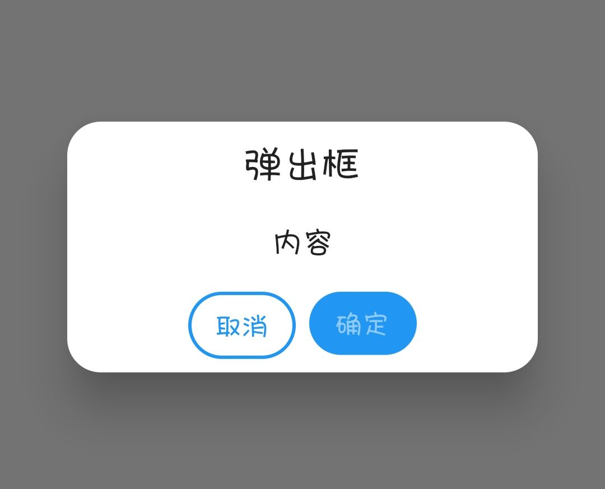
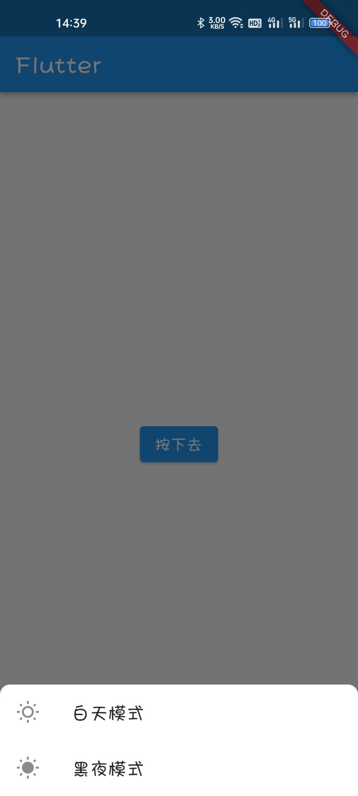
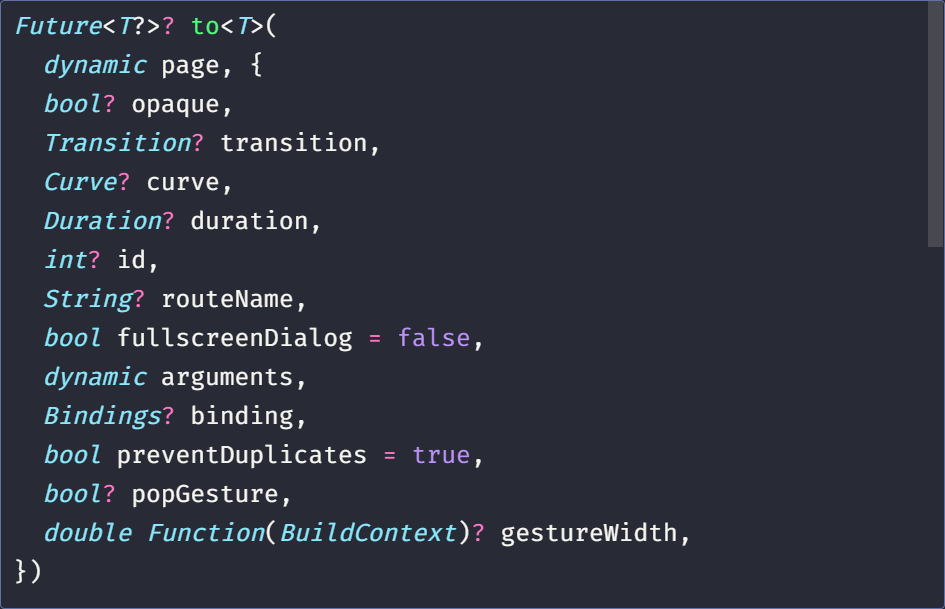

## 前言

急匆匆学完了 Flutter（当然后面肯定还要找时间巩固巩固），看的是 IT 营的 Flutter 基础课（也没记住多少），课程后面提到了 GetX，对于状态管理、路由、国际化等的帮助还是很大的，所以顺势就学了 GetX，官网的文档写的也不是特别完善，特别是对于我这种速成 Flutter 的**零基础**的，还是去 B 站找一个视频学习 GetX，初步筛选下，找到了这个视频：[Flutter GetX零基础视频教程](https://www.bilibili.com/video/BV1uq4y1U7fF/)。当然，这个视频里面讲的都是一些基础快速入门的内容，例如路由部分讲的不是特别详细，我会参考其他文章并且实践得到最佳使用方法并且记录下来。对于例如 `Obx` 的特别基本的使用我就不再记录，最终目标是写出尽量标准化的工程代码。

这位 up 主还有配套的博客教程：[Flutter GetX系列教程---介绍、Snackbar、Dialog、BottomSheet、Navigation、Obx | Jimi (liujunmin.com)](http://liujunmin.com/flutter/getx/introduction.html)

那么话不多说，开始学习。当然前面用的是真机进行测试的，后来换到了模拟器调试。

## 基本使用

一般来说我们在写 Flutter App 的时候，会使用 MaterialApp 作为应用顶层，如这样：

```dart
import 'package:flutter/material.dart';

void main() {
  runApp(const MyApp());
}

class MyApp extends StatelessWidget {
  const MyApp({super.key});

  @override
  Widget build(BuildContext context) {
    return MaterialApp(    // 使用 MaterialApp 作为应用顶层
      title: ...,
      home: ...,
    );
  }
}
```

如果我们使用 GetX 的一些功能例如路由功能，需要将 `MaterialApp` 替换为 `GetMaterialApp` ：

```dart
import 'package:flutter/material.dart';
import 'package:get/get.dart';    // 首先引入 GetX

void main() {
  runApp(const MyApp());
}

class MyApp extends StatelessWidget {
  const MyApp({super.key});

  @override
  Widget build(BuildContext context) {
    return GetMaterialApp(    // 使用 GetMaterialApp 作为应用顶层
      title: ...,
      home: ...,
    );
  }
}
```

当然其他功能比如 Obx 等不需要替换程序入口。使用 GetX 可以让我们尽量少使用 Stateful 组件，多的使用 Stateless 组件，提高应用性能。

## Snackbar

Snackbar 的作用就是弹出一个顶部消息提醒，如下图所示：


当点击按钮的时候顶部会弹出提示信息。

### Snackbar 基本使用

此组件的基本使用如下：

```dart
Get.snackbar(
    "Snackbar 标题",
    "欢迎使用Snackbar",
);
```

上面图片例子中，我们通过触发点击事件来执行此 Snackbar，提示标题为“Snackbar 标题”，提示内容为“欢迎使用Snackbar”。

完整组件代码如下：

```dart
class DemoWidget extends StatelessWidget {
  const DemoWidget({super.key});

  @override
  Widget build(BuildContext context) {
    // 按钮
    return Center(
        child: ElevatedButton(
            onPressed: () {
              Get.snackbar(
                "Snackbar 标题",
                "欢迎使用Snackbar",
              );
            },
            child: const Text("按下去")));
  }
}
```

我们查看一下参数列表：


可以看到 `Snackbar` 函数必传的参数为 `title` 和 `message` ，除此之外，`Snackbar` 函数还有其他可选参数，例如改变字体颜色，那么可以加上 `colorText` 参数，参数值类型为颜色类型：

```dart
Get.snackbar(
    "Snackbar 标题",
    "欢迎使用Snackbar",
    colorText: const Color.fromARGB(255, 207, 76, 76), // 改变字体颜色
);
```

### Snackbar 参数和说明

| 字段                             | 属性                   | 描述                                                         |
| -------------------------------- | ---------------------- | ------------------------------------------------------------ |
| title                            | String                 | 弹出的标题文字                                               |
| message                          | String                 | 弹出的消息文字                                               |
| colorText                        | Color                  | title和message的文字颜色                                     |
| duration                         | Duration               | Snackbar弹出的持续时间（默认3秒）                            |
| instantInit                      | bool                   | 当false可以把snackbar 放在initState，默认true                |
| snackPosition                    | SnackPosition          | 弹出时的位置，有两个选项【TOP，BOTTOM】默认TOP               |
| titleText                        | Widget                 | 弹出标题的组件，设置该属性会导致title属性失效                |
| messageText                      | Widget                 | 弹出消息的组件，设置该属性会导致messageText属性失效          |
| icon                             | Widget                 | 弹出时图标，显示在title和message的左侧                       |
| shouldIconPulse                  | bool                   | 弹出时图标是否闪烁，默认false                                |
| maxWidth                         | double                 | Snackbar最大的宽度                                           |
| margin                           | EdgeInsets             | Snackbar外边距，默认zero                                     |
| padding                          | EdgeInsets             | Snackbar内边距，默认EdgeInsets.all(16)                       |
| borderRadius                     | double                 | 边框圆角大小，默认15                                         |
| borderColor                      | Color                  | 边框的颜色，必须设置borderWidth，否则无效果                  |
| borderWidth                      | double                 | 边框的线条宽度                                               |
| backgroundColor                  | Color                  | Snackbar背景颜色，默认Colors.grey.withOpacity(0.2)           |
| leftBarIndicatorColor            | Color                  | 左侧指示器的颜色                                             |
| boxShadows                       | List                   | Snackbar阴影颜色                                             |
| backgroundGradient               | Gradient               | 背景的线性颜色                                               |
| mainButton                       | TextButton             | 主要按钮，一般显示发送、确认按钮                             |
| onTap                            | OnTap                  | 点击Snackbar事件回调                                         |
| isDismissible                    | bool                   | 是否开启Snackbar手势关闭，可配合dismissDirection使用         |
| showProgressIndicator            | bool                   | 是否显示进度条指示器，默认false                              |
| dismissDirection                 | SnackDismissDirection  | Snackbar关闭的方向                                           |
| progressIndicatorController      | AnimationController    | 进度条指示器的动画控制器                                     |
| progressIndicatorBackgroundColor | Color                  | 进度条指示器的背景颜色                                       |
| progressIndicatorValueColor      | Animation              | 进度条指示器的背景颜色，Animation                            |
| snackStyle                       | SnackStyle             | Snackbar是否会附加到屏幕边缘                                 |
| forwardAnimationCurve            | Curve                  | Snackbar弹出的动画，默认Curves.easeOutCirc                   |
| reverseAnimationCurve            | Curve                  | Snackbar消失的动画，默认Curves.easeOutCirc                   |
| animationDuration                | Duration               | Snackbar弹出和小时的动画时长，默认1秒                        |
| barBlur                          | double                 | Snackbar背景的模糊度                                         |
| overlayBlur                      | double                 | 弹出时的毛玻璃效果值，默认0                                  |
| snackbarStatus                   | SnackbarStatusCallback | Snackbar弹出或消失时的事件回调（即将打开、已打开、即将关闭、已关闭） |
| overlayColor                     | Color                  | 弹出时的毛玻璃的背景颜色                                     |
| userInputForm                    | Form                   | 用户输入表单                                                 |

## Dialog

`Dialog` 即弹出框，实际是对 `AlertDialog` 进行了封装。


当然我们可以对 `Dialog` 再次进行封装，以满足我们统一风格的定制。

我们可以新建一个 dart 文件，对 GetX 进行定制，包装成类或者函数供我们进行使用。

### Dialog 的基本使用

```dart
Get.defaultDialog();
```

在没有传任何参数时，效果如上图所示，GetX 的对话框有默认的文字，当我们传入参数后，文字会被替换掉。


下面的代码是弹出一个带有确认和取消按钮的弹出框：

```dart
Get.defaultDialog(
    title: "弹出框",
    content: const Text("内容"),
    textConfirm: "确定",
    textCancel: "取消",
);
```



这个确定按钮是禁用的因为我们没有传入处理事件。

默认的确认、取消的按钮样式不是很好看，我们可以使用 `confirm` 和 `cancel` 参数来定义我们的确定和取消按钮。不过想要达到类似于 QQ 那样平铺分配的按钮，我们需要使用 `actions` 来定义我们的按钮列表，例如：

```dart
Get.defaultDialog(
    title: "弹出框",
    content: const Text("内容"),
    actions: [
      Row(
        mainAxisAlignment: MainAxisAlignment.center,
        children: [
          Expanded(
            flex: 1,
            child: TextButton(
              onPressed: () {
                Get.back();
              },
              child: const Text("取消"),
            ),
          ),
          Expanded(
            flex: 1,
            child: ElevatedButton(
              onPressed: () {
                Get.back();
              },
              child: const Text("确定"),
            ),
          ),
        ],
      )
    ]
);
```

效果如下：


上面例子我们可以进一步修改，例如将 `padding` 设为 `0` 然后修改按钮样式或者使用 `Container` 替换掉默认按钮，以达到我们想要的效果，例如 QQ 的弹出框：


可以调整一下 `padding` 以及文字颜色背景颜色、圆角等达到类似的效果。

在调整好后可以进行封装等操作，方便我们在不同地方多次调用。

除此之外，其他的一些参数也是比较有用的。

### Dialog 参数和说明

| 字段               | 属性               | 描述                                         |
| ------------------ | ------------------ | -------------------------------------------- |
| title              | String             | 弹出的标题，默认（Alert)                     |
| titlePadding       | EdgeInsetsGeometry | 标题的内边距，默认（EdgeInsets.all(8)）      |
| titleStyle         | TextStyle          | 标题的样式                                   |
| middleText         | String             | 中间内容区域显示的文字                       |
| middleTextStyle    | TextStyle          | 中间内容区域显示的文字样式                   |
| content            | Widget             | 弹出的内容，该值设置后middleText将无效       |
| contentPadding     | EdgeInsetsGeometry | 内容的内边距，默认（EdgeInsets.all(8)）      |
| onConfirm          | VoidCallback       | 确认按钮回调                                 |
| onCancel           | VoidCallback       | 取消按钮回调                                 |
| onCustom           | VoidCallback       | 自定义按钮回调                               |
| cancelTextColor    | Color              | 取消按钮文字的颜色                           |
| confirmTextColor   | Color              | 确认按钮文字的颜色                           |
| textConfirm        | String             | 确认按钮的文字                               |
| textCancel         | String             | 取消按钮的文字                               |
| textCustom         | String             | 自定义按钮的文字                             |
| confirm            | Widget             | 确认按钮的组件                               |
| cancel             | Widget             | 取消按钮的组件                               |
| custom             | Widget             | 自定义按钮的组件                             |
| backgroundColor    | Color              | 弹出框的背景颜色                             |
| barrierDismissible | bool               | 是否可以通过点击背景关闭弹窗                 |
| buttonColor        | Color              | 按钮的文字颜色，根据按钮类型来设定不同的位置 |
| radius             | double             | 弹出框的圆角大小，默认20                     |
| actions            | List               | 增加额外的子组件                             |
| onWillPop          | WillPopCallback    | 拦截关闭之前做一些操作                       |
| navigatorKey       | GlobalKey          | 用于打开对话框的key                          |

## BottomSheet

`BottomSheet` 是底部弹出层。

###  BottomSheet 的基本使用

使用 `Get.bottomSheet` 来创建显示一个底部弹出层：

```dart
Get.bottomSheet(
	// ....里面放入组件
)
```

例如：

```dart
Get.bottomSheet(
    Container(
        child: Wrap(
          children: [
            ListTile(
              leading: const Icon(Icons.wb_sunny_outlined),
              title: const Text("白天模式"),
              onTap: () {
                Get.changeTheme(ThemeData.light());
              },
            ),
            ListTile(
              leading: const Icon(Icons.wb_sunny),
              title: const Text("黑夜模式"),
              onTap: () {
                Get.changeTheme(ThemeData.dark());
              },
            )
          ],
        ),
    )
);
```


我们实现的效果为：按下按钮执行 `Get.bottomSheet` 创建一个包含 “白天模式” 和 “黑夜模式” 的列表底部弹出。当点击对应的项时，使用 GetX 的功能进行主题的切换（后面会提到）。

上面的例子中，仅仅在底部弹出层里添加一个 `Container`，里面包含一个列表，没有配置背景色，因此没有背景，直接看到后面的半透明黑色幕布，当我们为 `Container` 添加一个背景色时，可以看到如下效果：

```dart
Container(
    decoration: const BoxDecoration(
      borderRadius: BorderRadius.only(
          topLeft: Radius.circular(10),
          topRight: Radius.circular(10)
      ), // 左上、右上圆角
      color: Colors.white, // 背景色
    ),
    child: ....,
)
```



当然，上面是我们最原始的实现方法，也适合高度定制，`Get.bottomSheet` 里面有参数可以供我们修改背景色和圆角形状，具体参数列表如下：

### BottomSheet 参数和说明

| 字段                     | 属性          | 描述                         |
| ------------------------ | ------------- | ---------------------------- |
| bottomsheet              | Widget        | 弹出的Widget组件             |
| backgroundColor          | Color         | bottomsheet的背景颜色        |
| elevation                | double        | bottomsheet的阴影            |
| persistent               | bool          | 是否添加到路由中             |
| shape                    | ShapeBorder   | 边框形状，一般用于圆角效果   |
| clipBehavior             | Clip          | 裁剪的方式                   |
| barrierColor             | Color         | 弹出层的背景颜色             |
| ignoreSafeArea           | bool          | 是否忽略安全适配             |
| isScrollControlled       | bool          | 是否支持全屏弹出，默认false  |
| useRootNavigator         | bool          | 是否使用根导航               |
| isDismissible            | bool          | 点击背景是否可关闭，默认ture |
| enableDrag               | bool          | 是否可以拖动关闭，默认true   |
| settings                 | RouteSettings | 路由设置                     |
| enterBottomSheetDuration | Duration      | bottomsheet进入时的动画时间  |
| exitBottomSheetDuration  | Duration      | bottomsheet退出时的动画时间  |

## Navigation

原生的 Flutter 自带了路由转跳，但是需要我们写许多代码，而 GetX 为我们进行了封装简化以及一些动画设置。

### Navigation 的基本使用

#### 使用 `to` 方法进行路由转跳

```dart
import 'package:path/home.dart';
Get.to(() => const Home());
```

我们可以在函数参数里面配置切换动画，可参考下图的参数列表配置参数：



其中，最常用的为 `transition` 切换动画以及 `arguments` 参数传递。

接受转跳页面的传参：

```dart
var data = await Get.to(() => const Home(), arguments: "Hello World"); // 转跳到 Home 页，并且携带参数 Hello World
print(data);  // 接收转跳到的 Home 页传来的数据
```

注意：`await` 的出现代表着该触发函数需要为 `async`。

当然，在转跳的 Home 页里，当我们返回转跳过来的父页面，想要传递数据要这样使用：

```dart
Get.back(result: "返回的数据");
```

转跳页面并携带参数的 `arguments` 函数参数在 `toNamed` 函数也是适用的。

#### 使用 `toNamed` 方法进行路由转跳

- 在应用程序入口 `GetMaterialApp` 进行路由配置，当然我们可以写成一个路由文件然后进行导入。

  ```dart
  import 'package:flutter/material.dart';
  import 'package:path/home.dart';
  import 'package:path/my.dart';
  import 'package:get/get.dart';
  
  void main() {
    runApp(MyApp());
  }
  
  class MyApp extends StatelessWidget {
    @override
    Widget build(BuildContext context) {
      return GetMaterialApp(
        title: "GetX",
        initialRoute: "/",
        defaultTransition: Transition.zoom,
        getPages: [
          GetPage(name: "/", page: () => const MyApp()),
          GetPage(name: "/home", page: () => const Home()),
          GetPage(name: "/my", page: () => const My(), transition: Transition.rightToLeft)
        ],
        home: MyDemo(),
      );
    }
  }
  ```

  其中 `initialRoute` 配置应用的根路由为：“`/`”。

  `defaultTransition` 配置默认的切换路由动画效果 `zoom`。

  `getPages` 配置我们的三个路由：`/`、`/home`、`/my`，并且使用 `transition` 参数来配置该路由的切换动画效果。后面会提到中间件的配置。`getPages` 配置比较多，可以参考官方文档进行配置。

- 在组件中调用 `toNamed`

  ```dart
  Get.toNamed("/my");
  ```

下图为 `Get.toNamed` 的参数列表


#### 使用 `back` 方法进行返回上一页

上面提到获取转跳的页面返回时的传参，使用的就是 `Get.back();`。

我们如果要返回上一个页面并携带参数，需要在 `back` 方法里加入 `result` 参数。

```dart
Get.back(result: "数据");
```

#### 使用 `off` 方法替换当前页面

与 React Router 类似，其中转跳方法里面有参数 `replace`，即替换当前页面而不是新开一个页面，因此使用替换当前页面进行页面的转跳，不能通过 `back` 方法返回上一页，若使用 `back` 方法，则返回的是上上个页面（如果上上个页面转跳上个页面用的不是 `off` 方法）。

```dart
Get.off(() => const Home());
Get.off("/home");
```

#### 使用 `offAll` 打开新页面，并关闭之前的所有页面

```dart
Get.offAll(() => const Home());
Get.offAll("/home");
```

#### `arguments` 传值的接收

通过 `Get.arguments` 进行传参值的接收：

```dart
class Home extends StatelessWidget {
  const Home({super.key});

  @override
  Widget build(BuildContext context) {
    print(Get.arguments); // 打印出参数值
    return Scaffold(
      appBar: ...,
      body: ...,
    );
  }
}
```

#### `parameters` 传值的接收

通过 `Get.parameters` 进行传值的接收，注意，`parameters` 传值类似于 URL 中的 `parameters` 传值，即路由地址加上 `?data=data`。

``` dart
class Home extends StatelessWidget {
  const Home({super.key});

  @override
  Widget build(BuildContext context) {
    print(Get.parameters); // 打印出参数值
    return Scaffold(
      appBar: ...,
      body: ...,
    );
  }
}
```

#### 使用中间件进行认证等操作

在使用 `toNamed` 方法配置路由列表的时候，使用 `GetPage` 进行路由的创建，其中 `middlewares` 参数配置我们的中间件，`middlewares` 里面为中间件的 `List`：

```dart
// 白名单
GetPage(
  name: AppRoutes.Login,
  page: () => LoginView(),
),
// 需要鉴权的路由
GetPage(
  name: AppRoutes.My,
  page: () => MyView(),
  middlewares: [
    RouteAuthMiddleware(),
  ],
),
```

其中，`RouteAuthMiddleware` 为：

我们在中间件中需要重写 `redirect` 方法，我们在里面处理路由的跳转，例如满足条件继续加载到目标路由或者不满足条件，跳转到登录页等。

如果我们不进行其他处理，继续跳转到目标路由，我们可以返回一个 `null`，如果进行跳转，可以直接返回一个 `RouteSettings` 函数，参数有两个：`name` 即路由名称地址、`arguments` 即传参，都是可选值，但是如果 `name` 不配置的话，会导致报错喔。

```dart
class RouteAuthMiddleware extends GetMiddleware {
  //需要继承GetMiddleware
  @override
  //需要实现系统的该方法
  RouteSettings? redirect(String? route) {
    //根据条件进行判断,满足条件进行跳转,否则不进行跳转（return null）
    if(满足条件) {
        return null; // 表示跳转到目标路由
    }
    return RouteSettings(name: "/login",arguments: {}); // 同时传参
  }
}
```

## Obx 响应式状态管理

### 定义 Obx 变量的三种方式

- 第一种 使用 `Rx{Type}`

    ```dart
    final name = RxString('');  // 字符串
    final isLogged = RxBool(false); // 布尔
    final count = RxInt(0); // 整型
    final balance = RxDouble(0.0); // 浮点数
    final items = RxList<String>([]); // List
    final myMap = RxMap<String, int>({}); // Map
    ```

- 第二种 使用 `Rx`，规定泛型 `Rx<Type>`。

  ```dart
  final name = Rx<String>(''); // 字符串
  final isLogged = Rx<Bool>(false); // 布尔
  final count = Rx<Int>(0); // 整型
  final balance = Rx<Double>(0.0); // 浮点数
  final number = Rx<Num>(0); // 数字
  final items = Rx<List<String>>([]); // 字符串 List
  final myMap = Rx<Map<String, int>>({}); // 字符串、数字 List
  // 自定义类 - 可以是任何类
  final user = Rx<User>();
  ```

- 第三种 只需添加 `.obs` 作为 `value` 的属性。（更实用、更简单、更可取的方法）

  ```dart
  final name = ''.obs;
  final isLogged = false.obs;
  final count = 0.obs;
  final balance = 0.0.obs;
  final number = 0.obs;
  final items = <String>[].obs;
  final myMap = <String, int>{}.obs;
  // 自定义类 - 可以是任何类
  final user = User().obs;
  ```

对于 Obx 的基础使用我这里就不再记录，因为后面会用到 `GetXController` 对 Obx 进行进阶使用，更符合写项目时候的代码习惯，如果结合 `GetXController` 使用能够理解的话，那么 Obx 的基础使用就自然而然就会了。

下面先讲述结合 `GetXController` 使用 Obx，后面再对 `GetXController` 进行具体记录。

当然，在使用 `GetXController` 进行控制 Obx 变量时，我们最好将变量及其操作函数放在一个类里面并放到单独的文件内，例如：

```dart
class CounterController extends GetxController {
  var count = 0.obs;
  increment() => count++;
  clear() => count.value = 0;
}
```

当我们在使用的时候，只需要引入此文件，在组件里面进行初始化等操作。

例如我们在主页面初始化控制器，使用 `Get.put()` 方法初始化一个控制器并赋值给类型为 `CounterController` （我们创建的控制器类）的变量 `c`：

```dart
class DemoWidget extends StatelessWidget {
  DemoWidget({super.key});
  final CounterController c = Get.put(CounterController()); // 初始化控制器
  @override
  Widget build(BuildContext context) {
    return Center(
      child: Column(children: [
        Container(
          margin: const EdgeInsets.only(top: 20),
          child: Obx(() => Text("点击了${c.count} 次")),  // 使用值
        ),
        ElevatedButton(
            onPressed: () {
              c.increment(); // 执行操作函数
            },
            child: const Text("点击＋1")),
        ElevatedButton(
            onPressed: () {
              c.clear(); // 执行操作函数
            },
            child: const Text("清除")),
      ]),
    );
  }
}
```

我们使用变量的时候需要在外面包裹 `Obx` 函数。

若我们在其他组件里想要调用相同的控制器，可以在该文件里引入我们控制器类所在的文件（如果其他组件与上面的这个主页面组件在一个文件里就不需要重复引入），并且在组件里使用 `Get.find()` 方法找到正在使用的相同控制器：

```dart
import 'package:flutter/material.dart';
// getx
import 'package:get/get.dart';
// 我们的控制器类放到了该文件内
import './store.dart';

class Test extends StatelessWidget {
  final CounterController c = Get.find<CounterController>(); // 找到控制器并赋值给 c
  Test({super.key});

  @override
  Widget build(BuildContext context) {
    return Obx(() => Text("点击了${c.count} 次")); // 使用
  }
}
```

这样，在主页面“清除”按钮后加上这个 `Test` 组件，运行可看到如下效果：


## GetXController

GetXController 主要作用就是 UI 代码和业务逻辑的分离。在前面记录的 Obx 的使用，他就是结合了 GetXController 进行管理的，并且其中 `Obx()` 即其中的一种

### 三种创建方式

首先：

```dart
class MyController extends GetxController {
```

- 第一种

  ```dart
  var teacher = Teacher();
  void convertToUpperCase() {
  	teacher.name.value = teacher.name.value.toUpperCase();
  }
  ```

- 第二种

  ```dart
  var teacher =  Teacher(name: "Jimi", age: 18).obs;
  void convertToUpperCase() {
  	teacher.update((val) {
  		teacher.value.name = teacher.value.name.toString().toUpperCase();
  	});
  }
  ```

- 第三种

  ```dart
  var teacher = Teacher();
  void convertToUpperCase() {
      teacher.name.value = teacher.name.value.toUpperCase();
      update();
  }
  ```

```dart
}
```

这样把它们放在 `MyController` 类（继承 `GetxController`）里，就实现了控制器的创建。

### 实例化控制器并使用（三种使用方式）

例如我们提前创建好上方的控制器类，下面要在组件里面实例化：

```dart
final MyController myController = Get.put(MyController());
```

实例化之后可以在子组件里进行使用，有三种方式：

- 第一种

  ```dart
  Obx(() => Text(
     "我的名字是 ${myController.teacher.name}",
     style: TextStyle(color: Colors.red, fontSize: 30),
  )),
  ```

- 第二种

  ```dart
  GetX<MyController>(
     init: MyController(),
     builder: (controller) {
        return Text(
           "我的名字是 ${controller.teacher.name}",
           style: TextStyle(color: Colors.green, fontSize: 30),
        );
     },
  ),
  ```

- 第三种

  ```dart
  GetBuilder<MyController>(
      init: myController,
      builder: (controller) {
          return Text(
              "我的名字是 ${controller.teacher.name}",
              style: TextStyle(color: Colors.green, fontSize: 30),
          );
      },
  ),
  ```

在前面的 Obx 的使用中已经介绍过第一种使用方法了。

### 事件监听

上面我们已经学会了创建控制器，这里我们简单的创建一个：

```dart
class WorkersController extends GetxController {
  var count = 0.obs;

  void increment() {
    count++;
  }
}
```

想要实现事件的监听，我们需要在类里重写 `onInit` 事件：

```dart
@override
void onInit() {

  // 监听count的值，当它发生改变的时候调用
  ever(count, (callback) => print("ever----$count"));

  // 监听多个值，当它们发生改变的时候调用
  everAll([count], (callback) => print("everAll----$count"));

  // count值改变时调用，只执行一次
  once(count, (callback) => print("once----$count"));

  // 用户停止打字时1秒后调用，主要是防抖
  debounce(count, (callback) => print("debounce----$count"));

  // 忽略3秒内的所有变动
  interval(count, (callback) => print("interval----$count"));

  super.onInit();
}
```

### 生命周期

在创建控制器类的时候，我们可以重写生命周期方法：

```dart
@override
void onInit() {
  // TODO: implement onInit
  print("初始化");
  super.onInit();
}

@override
void onReady() {
  // TODO: implement onReady
  print("加载完成");
  super.onReady();
}

@override
void onClose() {
  // TODO: implement onClose
  print("控制器被释放");
  super.onClose();
}
```

然后实例化使用：

```dart
GetBuilder<MyLifecycleController>(
    initState: (data) => myLifecycleController.increment(),
    dispose: (_) => myLifecycleController.cleanTask(),
    builder: (controller) {
        return Text(
            "计数器值为: ${myLifecycleController.count}",
            style: TextStyle(color: Colors.green, fontSize: 30),
        );
    },
),
```

上面代码当组件销毁的时候会执行 `cleanTask()` 清除计数器数据，初始化的时候会执行 `increment()`。

### UniqueID

我们在开发的过程中会碰到一种情况，就是多个地方引用了同一个属性，但我只想单独更新某一个地方，那么就可以用`UniqueID`来进行区分。

在创建控制器的时候加入 UniqueID：

```dart
import 'package:get/get.dart';

class CountController extends GetxController {
  var count = 0;

  void increment() {
    count++;
    update(['jimi_count']); // 在这里写入 id
  }
  
  void increment2() {
    count++;
    update();
  }
}
```

在实例化使用的时候：

```dart
GetBuilder<CountController>(
    id: 'jimi_count', // 加入 id
    builder: (controller) {
        return Text(
            "计数器值为: ${controller.count}",
            style: TextStyle(color: Colors.green, fontSize: 30),
        );
    },
),
GetBuilder<CountController>(
    builder: (controller) {
        return Text(
            "计数器值为: ${controller.count}",
            style: TextStyle(color: Colors.green, fontSize: 30),
        );
    },
),
```

此时如果触发 `increment()` ，上面的组件会显示 `count` 自增1，而下面的不会，触发 `increment2()`，下面的组件会在上面的组件的显示的 `count` 的值的基础上自增1，也就是说触发哪个 `increment` 都会导致 `count` 自增1，但是根据 id 的不同（2中没有标明id，但是这种情况下与1中指定的有所区分），组件显示的也会不同，标有相应id的组件会显示变化的值。

例如此时的 `children` 如下：

```dart
children: [
    GetBuilder<CountController>(
      builder: (controller) {
        return Text(
          "计数器值为: ${controller.count}",
          style: TextStyle(color: Colors.red, fontSize: 30),
        );
      },
    ),
    GetBuilder<CountController>(
      builder: (controller) {
        return Text(
          "计数器值为: ${controller.count}",
          style: TextStyle(color: Colors.red, fontSize: 30),
        );
      },
    ),
    GetBuilder<CountController>(
      id: 'jimi_count',
      builder: (controller) {
        return Text(
          "计数器值为: ${controller.count}",
          style: TextStyle(color: Colors.green, fontSize: 30),
        );
      },
    ),
    SizedBox(
      height: 20,
    ),
    ElevatedButton(
        onPressed: () => countController.increment(),
        child: Text("增加")),
    ElevatedButton(
        onPressed: () => countController.increment2(),
        child: Text("增加2"))
],
```

当我们点击”增加“按钮时，第一个和第二个组件同时会变化（因为没有指定id，与已指定id的有所区别），变化后的值为1，第三个组件的值不会变化，仍为0。当我们两次点击”增加2“按钮时，第三个组件会变化（第一第二无变化），变化后的值为3，因为我们指定了id，如果再加上同一个id的组件，值内容也会跟第三个组件一样变化，第一第二个组件不变化，值仍为1。再点击”增加“按钮时，第一第二个组件会变化，变化后的值为4，第三个组件仍为3。

看上面的文字有点绕脑子，自己手写一遍就会非常清晰明了。

## 国际化配置

### 程序入口

在 `GetMaterialApp` 中配置国际化：

```dart
GetMaterialApp(
    title: "GetX",
    translations: Messages(),
    locale: Locale('zh', 'CN'), //设置默认语言
    fallbackLocale: Locale("zh", "CN"), // 在配置错误的情况下,使用的语言
    home: InternationalizationExample(),
);
```

### 创建国际化类

创建一个类继承 `Translations`，重写 `keys`，类型为 Map。

```dart
import 'package:get/get.dart';

class Messages extends Translations {

  @override
  // TODO: implement keys
  Map<String, Map<String, String>> get keys => {
    'zh_CN': {
      'hello': "你好, 世界"
    },
    'en_US': {
      'hello': 'hello world'
    }
  };
}
```

### 创建控制器类，用于切换语言

创建一个控制器类，写入切换语言函数 `changeLanguage`，传入 `languageCode` 和 `countryCode`。然后使用 `Locale` 函数传入 `languageCode` 和 `countryCode` 获取地区参数。我们的语言类型组成为 `zh_CN` 用字符 `_` 隔开的。其中 `zh` 为我们所指的 `languageCode`，`CN` 为我们所指的 `countryCode`。因此在我们切换语言传入参数的时候，`languageCode` 和 `countryCode` 要对应我们配置的如 `zh_CN` 的 `zh` 和 `CN` 两个部分，参考下面的**实例化控制器并使用**。

函数里使用 `Get.updateLocale()` 切换语言，传入参数为使用 `Locale` 获取到的地区参数。

```dart
import 'dart:ui';
import 'package:get/get.dart';

class MessagesController extends GetxController {

  void changeLanguage(String languageCode, String  countryCode) {
    var locale = Locale(languageCode, countryCode);
    Get.updateLocale(locale);
  }
}
```

### 实例化控制器并使用

使用国际化语言只需要在字符串后面加上 `.tr`。GetX 会根据配置的国际化类里的内容转换为相应的内容。例如我们在 `zh_CN` 配置的内容为：

```json
'zh_CN': {
	'hello': "你好, 世界"
},
```

我们在使用 `‘hello’.tr` 会获取中文语言中 key 为 `‘hello’` 的 Map 键的值，即为 `你好，世界`。

```dart
import 'package:flutter/material.dart';
import 'package:flutter_getx_example/GetXControllerWorkersExample/WorkersConroller.dart';
import 'package:flutter_getx_example/InternationalizationExample/MessagesCnotroller.dart';
import 'package:get/get.dart';

class InternationalizationExample extends StatelessWidget {

  final MessagesController messagesController = Get.put(MessagesController());

  @override
  Widget build(BuildContext context) {
    return Scaffold(
      appBar: ...,
      body: Center(
        child: Column(
          children: [
            Text('hello'.tr), // 使用国际化语言
            ElevatedButton(
              onPressed: () => messagesController.changeLanguage('zh', "CN"),
              child: Text("切换到中文")
            ),
            SizedBox(height: 20,),
            ElevatedButton(
              onPressed: () => messagesController.changeLanguage('en', "US"),
              child: Text("切换到英文")
            ),
          ],
        ),
      ),
    );
  }
}
```

在上面的代码中使用了切换语言的函数 `changeLanguage`，传入两个参数 `languageCode` 和 `countryCode` 分别为 `zh` 和 `CN`，对应 `zh_CN`。

## 依赖注入

在上面的笔记中，我们使用 `Get.put(MyController())` 来进行控制器实例的创建，其实 `GetX` 还提供很多创建实例的方法，可根据不同的业务来进行创建，接下来我们简单介绍一下几个最常用的：

- `Get.put()`：不使用控制器实例也会被创建
- `Get.lazyPut()`：懒加载方式创建实例，只有在使用时才创建
- `Get.putAsync()`：`Get.put()` 的异步版本
- `Get.create()`：每次使用都会创建一个新的实例

### 代码演示

- 创建控制器

  ```dart
  import 'package:flutter_getx_example/ObxCustomClassExample/Teacher.dart';
  import 'package:get/get.dart';
  
  class MyController extends GetxController {
    var teacher = Teacher();
    
    void convertToUpperCase() {
       teacher.name.value = teacher.name.value.toUpperCase();
    }
  }
  ```

- 实例化控制器并使用

  - `Get.put()` 即使不使用控制器实例也会被创建；`tag` 将用于查找具有标签名称的实例；控制器在不使用时被处理，但如果永久为真，则实例将在整个应用程序中保持活动状态。

    ```dart
    final MyController myController = Get.put(MyController(), permanent: true);
    ```

  - `Get.lazyPut()` 实例将在使用时创建，它类似于 `permanent`，区别在于实例在不使用时被丢弃；但是当它再次被需要使用时，GetX 将重新创建实例。

    ```dart
    Get.lazyPut(()=> MyController());
    Get.lazyPut(()=> MyController(), tag: "instancel");
    ```

  - `Get.putSync()` 为 `Get.put()` 异步版本。

    ```dart
    Get.putAsync<MyController>(() async  => await MyController());
    ```

  - `Get.create()` 每次都将返回一个新的实例。

    ```dart
    Get.create<MyController>(() => MyController());
    ```

使用时：

```dart
// 放在 onPressed 触发：
onPressed: () {
    // 实例使用的 tag 创建
    // Get.find<MyController>(tag: 'instancel');

    Get.find<MyController>();
},
```

## Get Service

这个类就像一个 `GetxController`，它共享相同的生命周期 `onInit()`、`onReady()`、`onClose()`。 但里面没有 “逻辑”。它只是通知**GetX**的依赖注入系统，这个子类**不能**从内存中删除。所以如果你需要在你的应用程序的生命周期内对一个类实例进行绝对的持久化，那么就可以使用 `GetxService`。

- ### 创建 Service

  想要创建 Service，我们需要定义一个类继承 `GetxService`：

  ```dart
  import 'package:get/get.dart';
  import 'package:shared_preferences/shared_preferences.dart';
  
  class Service extends GetxService {
  
    Future<void> getCounter() async {
      SharedPreferences prefs = await SharedPreferences.getInstance();
      int count = (prefs.getInt("counter") ?? 0) + 1;
      print("count 的值为: $count");
      await prefs.setInt("counter", count);
    }
  }
  ```

- ### 初始化 Service

  我们需要创建一个初始化函数并在运行程序前进行调用：

  在初始化函数中我们需要使用 `async-await` 等待所有我们定义的服务启动成功，在 `main` 函数中也使用 `async-await` 进行调用，确保所有的服务启动成功。

  ```dart
  import 'package:flutter/material.dart';
  import 'package:flutter_getx_example/GetXServiceExample/GetXServiceExample.dart';
  import 'package:flutter_getx_example/GetXServiceExample/Service.dart';
  import 'package:get/get.dart';
  
  /// 初始化服务
  Future<void> main() async {
    await initServices();
    runApp(MyApp());
  }
  
  Future<void> initServices() async {
    print("初始化服务");
    await Get.putAsync(() async => await Service());
    print("所有服务启动");
  }
  
  class MyApp extends StatelessWidget {
    @override
    Widget build(BuildContext context) {
      return GetMaterialApp(
        title: "GetX",
        home: GetXServiceExample(),
      );
    }
  }
  ```

- ### 调用 Service

```dart
import 'package:flutter/material.dart';
import 'package:flutter_getx_example/GetXServiceExample/Service.dart';
import 'package:get/get.dart';

class GetXServiceExample extends StatelessWidget {

  @override
  Widget build(BuildContext context) {
    return Scaffold(
      appBar: AppBar(
        title: Text("GetX Service"),
      ),
      body: Center(
        child: Column(
          mainAxisAlignment: MainAxisAlignment.center,
          crossAxisAlignment: CrossAxisAlignment.center,
          children: [
            ElevatedButton(
              onPressed: () {
                Get.find<Service>().getCounter();
              },
              child: Text("点我加1"))
          ],
        ),
      ),
    );
  }
}
```

## Binding

在我们使用 `GetX` 状态管理器的时候，往往每次都是用需要手动实例化一个控制器，这样的话基本页面都需要实例化一次，这样就太麻烦了，而 `Binding` 能解决上述问题，可以在项目初始化时把所有需要进行状态管理的控制器进行统一初始化，接下来看代码演示：

- ### 声明需要进行的绑定控制器类

  下面有三个文件：

  #### ① AllControllerBinding.dart

  在这个文件中创建一个类继承 `Bindings`，重写 `dependencies()` 方法，在这个方法中启动我们所有的控制器：
  
  ```dart
  import 'package:flutter_getx_example/GetXBindingExample/controller/BindingHomeController.dart'; // 引入文件 ② 从而导入控制器 BindingMyController
  import 'package:flutter_getx_example/GetXBindingExample/controller/BindingMyController.dart'; // 引入文件 ③ 从而导入控制器 BindingHomeController
  import 'package:get/get.dart';
  
  class AllControllerBinding implements Bindings {
    
    @override
    void dependencies() {
      // TODO: implement dependencies
      Get.lazyPut<BindingMyController>(() => BindingMyController()); // 启动控制器
      Get.lazyPut<BindingHomeController>(() => BindingHomeController()); // 启动控制器
    }
  }
  ```
  
  #### ② BindingHomeController.dart
  
  ②和③文件都是定义控制器的，在上面文件中引入并启动
  
  ```dart
  import 'package:get/get.dart';
  
  class BindingHomeController extends GetxController {
      var count = 0.obs;
      void increment() {
        count++;
      }
  }
  ```
  
  #### ③ BindingMyController.dart
  
  ```dart
  import 'package:get/get.dart';
  
  class BindingMyController extends GetxController {
      var count = 0.obs;
      void increment() {
        count++;
      }
  }
  ```

我们的绑定文件就已经写好了，下面就要进行初始化，我们若要进行初始化，那么就要在项目启动的时候，在 `GetMaterialApp()` 里面使用参数 `initialBinding` 导入我们的实例化绑定类，如下所示：


- ### 在项目启动时进行初始化绑定

  #### ④ main.dart

  在主文件中我们在

  ```dart
  import 'package:flutter/material.dart';
  import 'package:flutter_getx_example/GetXBindingExample/binding/AllControllerBinding.dart'; // 引入文件 ① 即绑定文件，里面实现了绑定类，我们需要引入并且使用绑定类
  import 'package:flutter_getx_example/GetXBindingExample/GetXBindingExample.dart'; // 引入文件 ⑤，此文件里面有组件使用了控制器，我们引入就是为了使用这个组件
  import 'package:get/get.dart';
  
  void main() {
    runApp(MyApp());
  }
  
  
  class MyApp extends StatelessWidget {
    @override
    Widget build(BuildContext context) {
      /// GetX Binding
      return GetMaterialApp(
        title: "GetX",
        initialBinding: AllControllerBinding(), // 在这个地方我们初始化绑定
        home: GetXBindingExample(),
      );
    }
  }
  ```

  初始化绑定后我们就可以在组件中使用控制器了。

  ##### 路由绑定

  如果我们想绑定到指定路由内，我们可以在 `getPages` 配置项（上面已经提到过）里面在相应路由的 `GetPage` 方法内加上参数 `binding`，例如：

  > 注意：
  >
  > - 下面所说的 `BHomeControllerBinding` 其实就是控制器 `BindingHomeController` 的绑定类，与上面的 `AllControllerBinding` 不同的是，`AllControllerBinding` 是将两个控制器合并在一起的（`dependencies()` 方法里启动了两个控制器），而 `BHomeControllerBinding` 仅仅启动了 `BindingHomeController`，因此没啥太大区别。然而代码比较重复我就不再记录。
  > - `BHome` 组件内容与 `GetXBindingExample` 组件内容大致一样，因为为了演示路由绑定，因此复制粘贴了一个 `BHome` 组件页面，唯一的区别就是没有那个转跳按钮。

  ```dart
  getPages: [
      GetPage(
      	name: "/home",
          page: ()=> const BHome(),
          binding: BHomeControllerBinding() // 值为绑定类实例
      )
  ]
  ```

  此时运行是会报错的因为我们还没有对绑定类进行初始化，此时要在 `main()` 里面 `runApp()` 之前进行初始化：

  ```dart
  void main() {
      BMyControllerBinding().dependencies();
      runApp(MyApp());
  }
  ```

  当然如果我们不想使用单独的绑定类，也可以绑定构建器，那么 `binding` 参数此时应该这样写（使用 `BindingsBuilder()` 方法）：

  ```dart
  binding: BindingsBuilder(() => {
      Get.lazyPut<BindingHomeController>(() => BindingHomeController())
  })
  ```

  此时 `main()` 函数里面**不需要**再初始化控制器了。

- ### 在页面中使用状态管理器

  #### ⑤ GetXBindingExample.dart

  此文件内包含 `main.dart` 文件中引入的组件 `GetXBindingExample`，在这个组件里我们使用控制器 `BindingMyController`，我们只需要引入这个类并且使用 `Get.find()` 例如 `Get.find<BindingMyController>()` 就可以使用该控制器。

  在 `BHome` 组件里（没有展示代码）我们使用的不是 `BindingMyController` 而是 `BindingHomeController` 是为了演示**路由绑定**。

  ```dart
  import 'package:flutter/material.dart';
  import 'package:flutter_getx_example/GetXBindingExample/BHome.dart'; // 这个文件是一个页面组件，我们下面要使用路由转跳绑定进行演示 注释1（见下面使用例子里的解释）
  import 'package:flutter_getx_example/GetXBindingExample/binding/BHomeControllerBinding.dart'; // 这个文件里面 BHome 页面组件使用的绑定类，我们在不使用声明式路由的时候在参数中使用绑定需要使用绑定类 注释1（见下面使用例子里的解释）
  import 'package:flutter_getx_example/GetXBindingExample/controller/BindingMyController.dart'; // 引入文件 ③，即我们想使用的控制器
  import 'package:get/get.dart';
  
  class GetXBindingExample extends StatelessWidget {
    @override
    Widget build(BuildContext context) {
      return Scaffold(
        appBar: AppBar(
          title: Text("GetXBinding"),
        ),
        body: Center(
          child: Column(
            mainAxisAlignment: MainAxisAlignment.center,
            crossAxisAlignment: CrossAxisAlignment.center,
            children: [
              Obx(() => Text(
                // 我们可以直接通过 Get.find() 来查找并使用我们的控制器
                "计数器的值为 ${Get.find<BindingMyController>().count}",
                style: TextStyle(color: Colors.red, fontSize: 30),
              )),
              SizedBox(height: 20,),
              ElevatedButton(
                onPressed: () {
                  Get.find<BindingMyController>().increment();
                },
                child: Text("点击加1")
              ),
              SizedBox(height: 20,),
              ElevatedButton(
                onPressed: () {
                  // 没有绑定进入页面，则点击加1没有效果
                  Get.to(BHome());
  
                  // 若在声明式路由 即 getPages 里面配置了绑定，那么使用声明式路由转跳会使用控制器，点击加1是有效果的
                  // Get.toNamed("/bHome");
  
                  // 若不使用声明式路由并且想要使用绑定，需要添加参数 binding，值为绑定类实例
                  // 注释1：若不使用这种方式，注释1引入的两个文件都不需要引入了。
                  // Get.to(BHome(), binding: BHomeControllerBinding());
                },
                child: Text("跳转去 Home 页")
              ),
            ],
          ),
        ),
      );
    }
  }
  ```


> 将服务器获取的数据转为类型，可以使用这个网站：[Instantly parse JSON in any language | quicktype](https://app.quicktype.io/)
>
> 只需要把数据粘贴到左侧右侧选择相应的语言就可以生成。


## GetUtils

`GetUtils ` 是 `getx` 为我们提供一些常用的工具类库，包括**值是否为空**、**是否是数字**、**是否是视频、图片、音频、PPT、Word、APK**、**邮箱、手机号码、日期、MD5、SHA1**等等。

以判断是否是邮箱、手机号、IPV4地址为例：

```dart
import 'package:flutter/material.dart';
import 'package:get/get.dart';

class GetXUtilsExample extends StatelessWidget {

  var textFieldController = TextEditingController();

  @override
  Widget build(BuildContext context) {
    return Scaffold(
      appBar: AppBar(
        title: Text("GetX Utils"),
      ),
      body: Center(
        child: Column(
          mainAxisAlignment: MainAxisAlignment.center,
          crossAxisAlignment: CrossAxisAlignment.center,
          children: [
            Padding(
              padding: EdgeInsets.all(20),
              child: TextField(
                controller: textFieldController,
              ),
            ),
            SizedBox(height: 10,),
            Padding(
              padding: EdgeInsets.all(10),
              child: ElevatedButton(
                child: Text("判断是否是邮箱"),
                onPressed: () async {
                  if (GetUtils.isEmail(textFieldController.text)) {
                    Get.snackbar("正确", "恭喜你, 完全正确", backgroundColor: Colors.greenAccent);
                  } else {
                    Get.snackbar(
                        "邮箱错误",
                        "请输入正确的邮箱",
                        backgroundColor: Colors.pink
                    );
                  }
                },
              ),
            ),
            Padding(
              padding: EdgeInsets.all(10),
              child: ElevatedButton(
                child: Text("判断是否是手机号"),
                onPressed: () async {
                  if (GetUtils.isPhoneNumber(textFieldController.text)) {

                    Get.snackbar("正确", "恭喜你, 完全正确", backgroundColor: Colors.greenAccent);
                  } else {
                    Get.snackbar(
                        "手机号错误",
                        "请输入正确的手机号",
                        backgroundColor: Colors.pink
                    );
                  }
                },
              ),
            ),
            Padding(
              padding: EdgeInsets.all(10),
              child: ElevatedButton(
                child: Text("判断是否是IPv4"),
                onPressed: () async {
                  if (GetUtils.isIPv4(textFieldController.text)) {

                    Get.snackbar("正确", "恭喜你, 完全正确", backgroundColor: Colors.greenAccent);
                  } else {
                    Get.snackbar(
                        "地址错误",
                        "请输入正确的IPv4地址",
                        backgroundColor: Colors.pink
                    );
                  }
                },
              ),
            ),
          ],
        ),
      ),
    );
  }
}

```

`GetUtils` 有以下方法（转自文档）：

### 属性

- *[hashCode](https://api.dart.dev/stable/3.0.5/dart-core/Object/hashCode.html)* → [int](https://api.dart.dev/stable/3.0.5/dart-core/int-class.html)

  The hash code for this object.read-onlyinherited

- *[runtimeType](https://api.dart.dev/stable/3.0.5/dart-core/Object/runtimeType.html)* → [Type](https://api.dart.dev/stable/3.0.5/dart-core/Type-class.html)

  A representation of the runtime type of the object.read-onlyinherited

### 方法

- *[noSuchMethod](https://api.dart.dev/stable/3.0.5/dart-core/Object/noSuchMethod.html)*([Invocation](https://api.dart.dev/stable/3.0.5/dart-core/Invocation-class.html) invocation) → dynamic

  Invoked when a nonexistent method or property is accessed.inherited

- *[toString](https://api.dart.dev/stable/3.0.5/dart-core/Object/toString.html)*() → [String](https://api.dart.dev/stable/3.0.5/dart-core/String-class.html)

  A string representation of this object.inherited

### Operators

- *[operator ==](https://api.dart.dev/stable/3.0.5/dart-core/Object/operator_equals.html)*([Object](https://api.dart.dev/stable/3.0.5/dart-core/Object-class.html) other) → [bool](https://api.dart.dev/stable/3.0.5/dart-core/bool-class.html)

  The equality operator.inherited

### 静态方法

- [camelCase](https://pub.dev/documentation/get/latest/get_utils_src_get_utils_get_utils/GetUtils/camelCase.html)([String](https://api.dart.dev/stable/3.0.5/dart-core/String-class.html) value) → [String](https://api.dart.dev/stable/3.0.5/dart-core/String-class.html)?

  用于将短句子或者短语转为驼峰字符串

  Example: your name => yourName

- [capitalize](https://pub.dev/documentation/get/latest/get_utils_src_get_utils_get_utils/GetUtils/capitalize.html)([String](https://api.dart.dev/stable/3.0.5/dart-core/String-class.html) value) → [String](https://api.dart.dev/stable/3.0.5/dart-core/String-class.html)?

  将每个单词首字母大写

  Example: your name => Your Name

- [capitalizeFirst](https://pub.dev/documentation/get/latest/get_utils_src_get_utils_get_utils/GetUtils/capitalizeFirst.html)([String](https://api.dart.dev/stable/3.0.5/dart-core/String-class.html) s) → [String](https://api.dart.dev/stable/3.0.5/dart-core/String-class.html)?

  将第一个单词首字母大写

  Example: your name => Your name

- [createPath](https://pub.dev/documentation/get/latest/get_utils_src_get_utils_get_utils/GetUtils/createPath.html)([String](https://api.dart.dev/stable/3.0.5/dart-core/String-class.html) path, [[Iterable](https://api.dart.dev/stable/3.0.5/dart-core/Iterable-class.html)? segments]) → [String](https://api.dart.dev/stable/3.0.5/dart-core/String-class.html)

  

- [hasCapitalletter](https://pub.dev/documentation/get/latest/get_utils_src_get_utils_get_utils/GetUtils/hasCapitalletter.html)([String](https://api.dart.dev/stable/3.0.5/dart-core/String-class.html) s) → [bool](https://api.dart.dev/stable/3.0.5/dart-core/bool-class.html)

  检查字符串中是否含有大写字母

- [hasMatch](https://pub.dev/documentation/get/latest/get_utils_src_get_utils_get_utils/GetUtils/hasMatch.html)([String](https://api.dart.dev/stable/3.0.5/dart-core/String-class.html)? value, [String](https://api.dart.dev/stable/3.0.5/dart-core/String-class.html) pattern) → [bool](https://api.dart.dev/stable/3.0.5/dart-core/bool-class.html)

  

- [isAlphabetOnly](https://pub.dev/documentation/get/latest/get_utils_src_get_utils_get_utils/GetUtils/isAlphabetOnly.html)([String](https://api.dart.dev/stable/3.0.5/dart-core/String-class.html) s) → [bool](https://api.dart.dev/stable/3.0.5/dart-core/bool-class.html)

  检查字符串是否仅由字母组成。 (不包含空格)

- [isAPK](https://pub.dev/documentation/get/latest/get_utils_src_get_utils_get_utils/GetUtils/isAPK.html)([String](https://api.dart.dev/stable/3.0.5/dart-core/String-class.html) filePath) → [bool](https://api.dart.dev/stable/3.0.5/dart-core/bool-class.html)

  检查路径地址是否为 APK 文件地址 (判断字符串结尾是不是 `.apk`)

- [isAudio](https://pub.dev/documentation/get/latest/get_utils_src_get_utils_get_utils/GetUtils/isAudio.html)([String](https://api.dart.dev/stable/3.0.5/dart-core/String-class.html) filePath) → [bool](https://api.dart.dev/stable/3.0.5/dart-core/bool-class.html)

  检查路径地址是否为音频文件地址 (判断字符串结尾是不是常见的音频格式)

- [isBinary](https://pub.dev/documentation/get/latest/get_utils_src_get_utils_get_utils/GetUtils/isBinary.html)([String](https://api.dart.dev/stable/3.0.5/dart-core/String-class.html) s) → [bool](https://api.dart.dev/stable/3.0.5/dart-core/bool-class.html)

  检查字符是否为二进制

- [isBlank](https://pub.dev/documentation/get/latest/get_utils_src_get_utils_get_utils/GetUtils/isBlank.html)(dynamic value) → [bool](https://api.dart.dev/stable/3.0.5/dart-core/bool-class.html)?

  检查数据是否为纯空格组成或者空白字符串

- [isBool](https://pub.dev/documentation/get/latest/get_utils_src_get_utils_get_utils/GetUtils/isBool.html)([String](https://api.dart.dev/stable/3.0.5/dart-core/String-class.html) value) → [bool](https://api.dart.dev/stable/3.0.5/dart-core/bool-class.html)

  检查字符串是否为布尔（`true` 或 `false`）

- [isCaseInsensitiveContains](https://pub.dev/documentation/get/latest/get_utils_src_get_utils_get_utils/GetUtils/isCaseInsensitiveContains.html)([String](https://api.dart.dev/stable/3.0.5/dart-core/String-class.html) a, [String](https://api.dart.dev/stable/3.0.5/dart-core/String-class.html) b) → [bool](https://api.dart.dev/stable/3.0.5/dart-core/bool-class.html)

  检查字符串 `a` 中是否包含字符串 `b` (不区分大小写)

- [isCaseInsensitiveContainsAny](https://pub.dev/documentation/get/latest/get_utils_src_get_utils_get_utils/GetUtils/isCaseInsensitiveContainsAny.html)([String](https://api.dart.dev/stable/3.0.5/dart-core/String-class.html) a, [String](https://api.dart.dev/stable/3.0.5/dart-core/String-class.html) b) → [bool](https://api.dart.dev/stable/3.0.5/dart-core/bool-class.html)

  检查字符串 `a` 中是否包含字符串 `b` 或字符串 `b` 中是否包含字符串 `a` (不区分大小写) 

- [isChm](https://pub.dev/documentation/get/latest/get_utils_src_get_utils_get_utils/GetUtils/isChm.html)([String](https://api.dart.dev/stable/3.0.5/dart-core/String-class.html) filePath) → [bool](https://api.dart.dev/stable/3.0.5/dart-core/bool-class.html)

  检查路径地址是否为 chm 文件地址

- [isCnpj](https://pub.dev/documentation/get/latest/get_utils_src_get_utils_get_utils/GetUtils/isCnpj.html)([String](https://api.dart.dev/stable/3.0.5/dart-core/String-class.html) cnpj) → [bool](https://api.dart.dev/stable/3.0.5/dart-core/bool-class.html)

  

- [isCpf](https://pub.dev/documentation/get/latest/get_utils_src_get_utils_get_utils/GetUtils/isCpf.html)([String](https://api.dart.dev/stable/3.0.5/dart-core/String-class.html) cpf) → [bool](https://api.dart.dev/stable/3.0.5/dart-core/bool-class.html)

  检查字符串是否为有效 cpf

- [isCurrency](https://pub.dev/documentation/get/latest/get_utils_src_get_utils_get_utils/GetUtils/isCurrency.html)([String](https://api.dart.dev/stable/3.0.5/dart-core/String-class.html) s) → [bool](https://api.dart.dev/stable/3.0.5/dart-core/bool-class.html)

  检查字符串是否为货币

- [isDateTime](https://pub.dev/documentation/get/latest/get_utils_src_get_utils_get_utils/GetUtils/isDateTime.html)([String](https://api.dart.dev/stable/3.0.5/dart-core/String-class.html) s) → [bool](https://api.dart.dev/stable/3.0.5/dart-core/bool-class.html)

  检查字符串是否为时间戳 (UTC or Iso8601)

- [isEmail](https://pub.dev/documentation/get/latest/get_utils_src_get_utils_get_utils/GetUtils/isEmail.html)([String](https://api.dart.dev/stable/3.0.5/dart-core/String-class.html) s) → [bool](https://api.dart.dev/stable/3.0.5/dart-core/bool-class.html)

  检查字符串是否为邮箱格式

- [isEqual](https://pub.dev/documentation/get/latest/get_utils_src_get_utils_get_utils/GetUtils/isEqual.html)([num](https://api.dart.dev/stable/3.0.5/dart-core/num-class.html) a, [num](https://api.dart.dev/stable/3.0.5/dart-core/num-class.html) b) → [bool](https://api.dart.dev/stable/3.0.5/dart-core/bool-class.html)

  检查两个数字是否相等

- [isExcel](https://pub.dev/documentation/get/latest/get_utils_src_get_utils_get_utils/GetUtils/isExcel.html)([String](https://api.dart.dev/stable/3.0.5/dart-core/String-class.html) filePath) → [bool](https://api.dart.dev/stable/3.0.5/dart-core/bool-class.html)

  检查路径地址是否为 Excel 文件地址

- [isGreaterThan](https://pub.dev/documentation/get/latest/get_utils_src_get_utils_get_utils/GetUtils/isGreaterThan.html)([num](https://api.dart.dev/stable/3.0.5/dart-core/num-class.html) a, [num](https://api.dart.dev/stable/3.0.5/dart-core/num-class.html) b) → [bool](https://api.dart.dev/stable/3.0.5/dart-core/bool-class.html)

  比较数字 `a` 是否大于数字 `b`

- [isHexadecimal](https://pub.dev/documentation/get/latest/get_utils_src_get_utils_get_utils/GetUtils/isHexadecimal.html)([String](https://api.dart.dev/stable/3.0.5/dart-core/String-class.html) s) → [bool](https://api.dart.dev/stable/3.0.5/dart-core/bool-class.html)

  检查字符串是否为十六进制

  Example: HexColor => #12F

- [isHTML](https://pub.dev/documentation/get/latest/get_utils_src_get_utils_get_utils/GetUtils/isHTML.html)([String](https://api.dart.dev/stable/3.0.5/dart-core/String-class.html) filePath) → [bool](https://api.dart.dev/stable/3.0.5/dart-core/bool-class.html)

  检查路径地址是否为 HTML 文件地址

- [isImage](https://pub.dev/documentation/get/latest/get_utils_src_get_utils_get_utils/GetUtils/isImage.html)([String](https://api.dart.dev/stable/3.0.5/dart-core/String-class.html) filePath) → [bool](https://api.dart.dev/stable/3.0.5/dart-core/bool-class.html)

  检查路径地址是否为图片文件地址

- [isIPv4](https://pub.dev/documentation/get/latest/get_utils_src_get_utils_get_utils/GetUtils/isIPv4.html)([String](https://api.dart.dev/stable/3.0.5/dart-core/String-class.html) s) → [bool](https://api.dart.dev/stable/3.0.5/dart-core/bool-class.html)

  检查字符串是否为 IPv4 地址

- [isIPv6](https://pub.dev/documentation/get/latest/get_utils_src_get_utils_get_utils/GetUtils/isIPv6.html)([String](https://api.dart.dev/stable/3.0.5/dart-core/String-class.html) s) → [bool](https://api.dart.dev/stable/3.0.5/dart-core/bool-class.html)

  检查字符串是否为 IPv6 地址

- [isLengthBetween](https://pub.dev/documentation/get/latest/get_utils_src_get_utils_get_utils/GetUtils/isLengthBetween.html)(dynamic value, [int](https://api.dart.dev/stable/3.0.5/dart-core/int-class.html) minLength, [int](https://api.dart.dev/stable/3.0.5/dart-core/int-class.html) maxLength) → [bool](https://api.dart.dev/stable/3.0.5/dart-core/bool-class.html)

  检查数据长度是否在 `minLength` 到 `maxLength` 之间

- [isLengthEqualTo](https://pub.dev/documentation/get/latest/get_utils_src_get_utils_get_utils/GetUtils/isLengthEqualTo.html)(dynamic value, [int](https://api.dart.dev/stable/3.0.5/dart-core/int-class.html) otherLength) → [bool](https://api.dart.dev/stable/3.0.5/dart-core/bool-class.html)

  检查数据长度是否等于 `otherLength`

- [isLengthGreaterOrEqual](https://pub.dev/documentation/get/latest/get_utils_src_get_utils_get_utils/GetUtils/isLengthGreaterOrEqual.html)(dynamic value, [int](https://api.dart.dev/stable/3.0.5/dart-core/int-class.html) maxLength) → [bool](https://api.dart.dev/stable/3.0.5/dart-core/bool-class.html)

  检查数据长度是否大于或等于 `maxLength`

- [isLengthGreaterThan](https://pub.dev/documentation/get/latest/get_utils_src_get_utils_get_utils/GetUtils/isLengthGreaterThan.html)(dynamic value, [int](https://api.dart.dev/stable/3.0.5/dart-core/int-class.html) maxLength) → [bool](https://api.dart.dev/stable/3.0.5/dart-core/bool-class.html)

  检查数据长度是否大于 `maxLength`

- [isLengthLessOrEqual](https://pub.dev/documentation/get/latest/get_utils_src_get_utils_get_utils/GetUtils/isLengthLessOrEqual.html)(dynamic value, [int](https://api.dart.dev/stable/3.0.5/dart-core/int-class.html) maxLength) → [bool](https://api.dart.dev/stable/3.0.5/dart-core/bool-class.html)

  检查数据长度是否小于或等于 `maxLength`

- [isLengthLessThan](https://pub.dev/documentation/get/latest/get_utils_src_get_utils_get_utils/GetUtils/isLengthLessThan.html)(dynamic value, [int](https://api.dart.dev/stable/3.0.5/dart-core/int-class.html) maxLength) → [bool](https://api.dart.dev/stable/3.0.5/dart-core/bool-class.html)

  检查数据长度是否小于 `maxLength`

- [isLengthLowerOrEqual](https://pub.dev/documentation/get/latest/get_utils_src_get_utils_get_utils/GetUtils/isLengthLowerOrEqual.html)(dynamic value, [int](https://api.dart.dev/stable/3.0.5/dart-core/int-class.html) maxLength) → [bool](https://api.dart.dev/stable/3.0.5/dart-core/bool-class.html)

  检查数据长度是否小于或等于 `maxLength` （方法废除，用 `isLengthLessOrEqual` 代替）

- [isLengthLowerThan](https://pub.dev/documentation/get/latest/get_utils_src_get_utils_get_utils/GetUtils/isLengthLowerThan.html)(dynamic value, [int](https://api.dart.dev/stable/3.0.5/dart-core/int-class.html) maxLength) → [bool](https://api.dart.dev/stable/3.0.5/dart-core/bool-class.html)

  检查数据长度是否小于 `maxLength`（方法废除，用 `isLengthLessThan` 代替）

- [isLowerThan](https://pub.dev/documentation/get/latest/get_utils_src_get_utils_get_utils/GetUtils/isLowerThan.html)([num](https://api.dart.dev/stable/3.0.5/dart-core/num-class.html) a, [num](https://api.dart.dev/stable/3.0.5/dart-core/num-class.html) b) → [bool](https://api.dart.dev/stable/3.0.5/dart-core/bool-class.html)

  检查数字 `a` 是否小于数字 `b`

- [isMD5](https://pub.dev/documentation/get/latest/get_utils_src_get_utils_get_utils/GetUtils/isMD5.html)([String](https://api.dart.dev/stable/3.0.5/dart-core/String-class.html) s) → [bool](https://api.dart.dev/stable/3.0.5/dart-core/bool-class.html)

  检查字符串是否为 MD5

- [isNull](https://pub.dev/documentation/get/latest/get_utils_src_get_utils_get_utils/GetUtils/isNull.html)(dynamic value) → [bool](https://api.dart.dev/stable/3.0.5/dart-core/bool-class.html)

  检查数据是否为空 `null`

- [isNullOrBlank](https://pub.dev/documentation/get/latest/get_utils_src_get_utils_get_utils/GetUtils/isNullOrBlank.html)(dynamic value) → [bool](https://api.dart.dev/stable/3.0.5/dart-core/bool-class.html)?

  检查数据是否为 `null` 或者空白 (为空或者仅由空格组成)

- [isNum](https://pub.dev/documentation/get/latest/get_utils_src_get_utils_get_utils/GetUtils/isNum.html)([String](https://api.dart.dev/stable/3.0.5/dart-core/String-class.html) value) → [bool](https://api.dart.dev/stable/3.0.5/dart-core/bool-class.html)

  检查字符串是否是否符合整型或者浮点型格式

- [isNumericOnly](https://pub.dev/documentation/get/latest/get_utils_src_get_utils_get_utils/GetUtils/isNumericOnly.html)([String](https://api.dart.dev/stable/3.0.5/dart-core/String-class.html) s) → [bool](https://api.dart.dev/stable/3.0.5/dart-core/bool-class.html)

  检查字符串是否只包含数字。数字不包含"`.`"。

- [isOneAKind](https://pub.dev/documentation/get/latest/get_utils_src_get_utils_get_utils/GetUtils/isOneAKind.html)(dynamic value) → [bool](https://api.dart.dev/stable/3.0.5/dart-core/bool-class.html)

  检查所有数据是否具有相同的值

  Example: 111111 -> true, wwwww -> true, 1,1,1,1 -> true

- [isPalindrom](https://pub.dev/documentation/get/latest/get_utils_src_get_utils_get_utils/GetUtils/isPalindrom.html)([String](https://api.dart.dev/stable/3.0.5/dart-core/String-class.html) string) → [bool](https://api.dart.dev/stable/3.0.5/dart-core/bool-class.html)

  检查字符串是否为 Palindrom

- [isPassport](https://pub.dev/documentation/get/latest/get_utils_src_get_utils_get_utils/GetUtils/isPassport.html)([String](https://api.dart.dev/stable/3.0.5/dart-core/String-class.html) s) → [bool](https://api.dart.dev/stable/3.0.5/dart-core/bool-class.html)

  检查字符串是否为护照号码

- [isPDF](https://pub.dev/documentation/get/latest/get_utils_src_get_utils_get_utils/GetUtils/isPDF.html)([String](https://api.dart.dev/stable/3.0.5/dart-core/String-class.html) filePath) → [bool](https://api.dart.dev/stable/3.0.5/dart-core/bool-class.html)

  检查路径地址是否为 PDF 文件地址

- [isPhoneNumber](https://pub.dev/documentation/get/latest/get_utils_src_get_utils_get_utils/GetUtils/isPhoneNumber.html)([String](https://api.dart.dev/stable/3.0.5/dart-core/String-class.html) s) → [bool](https://api.dart.dev/stable/3.0.5/dart-core/bool-class.html)

  检查字符串是否为手机号格式

- [isPPT](https://pub.dev/documentation/get/latest/get_utils_src_get_utils_get_utils/GetUtils/isPPT.html)([String](https://api.dart.dev/stable/3.0.5/dart-core/String-class.html) filePath) → [bool](https://api.dart.dev/stable/3.0.5/dart-core/bool-class.html)

  检查路径地址是否为 PPT 文件地址

- [isSHA1](https://pub.dev/documentation/get/latest/get_utils_src_get_utils_get_utils/GetUtils/isSHA1.html)([String](https://api.dart.dev/stable/3.0.5/dart-core/String-class.html) s) → [bool](https://api.dart.dev/stable/3.0.5/dart-core/bool-class.html)

  检查字符串是否为 SHA1

- [isSHA256](https://pub.dev/documentation/get/latest/get_utils_src_get_utils_get_utils/GetUtils/isSHA256.html)([String](https://api.dart.dev/stable/3.0.5/dart-core/String-class.html) s) → [bool](https://api.dart.dev/stable/3.0.5/dart-core/bool-class.html)

  检查字符串是否为 SHA256

- [isSSN](https://pub.dev/documentation/get/latest/get_utils_src_get_utils_get_utils/GetUtils/isSSN.html)([String](https://api.dart.dev/stable/3.0.5/dart-core/String-class.html) s) → [bool](https://api.dart.dev/stable/3.0.5/dart-core/bool-class.html)

  检查字符串是否为SSN（社会安全号）

- [isTxt](https://pub.dev/documentation/get/latest/get_utils_src_get_utils_get_utils/GetUtils/isTxt.html)([String](https://api.dart.dev/stable/3.0.5/dart-core/String-class.html) filePath) → [bool](https://api.dart.dev/stable/3.0.5/dart-core/bool-class.html)

  检查路径地址是否为文本文件地址

- [isURL](https://pub.dev/documentation/get/latest/get_utils_src_get_utils_get_utils/GetUtils/isURL.html)([String](https://api.dart.dev/stable/3.0.5/dart-core/String-class.html) s) → [bool](https://api.dart.dev/stable/3.0.5/dart-core/bool-class.html)

  检查字符串是否为网址格式

- [isUsername](https://pub.dev/documentation/get/latest/get_utils_src_get_utils_get_utils/GetUtils/isUsername.html)([String](https://api.dart.dev/stable/3.0.5/dart-core/String-class.html) s) → [bool](https://api.dart.dev/stable/3.0.5/dart-core/bool-class.html)

  检查字符串是否为有效的用户名

- [isVector](https://pub.dev/documentation/get/latest/get_utils_src_get_utils_get_utils/GetUtils/isVector.html)([String](https://api.dart.dev/stable/3.0.5/dart-core/String-class.html) filePath) → [bool](https://api.dart.dev/stable/3.0.5/dart-core/bool-class.html)

  检查路径地址是否为 vector 文件地址

- [isVideo](https://pub.dev/documentation/get/latest/get_utils_src_get_utils_get_utils/GetUtils/isVideo.html)([String](https://api.dart.dev/stable/3.0.5/dart-core/String-class.html) filePath) → [bool](https://api.dart.dev/stable/3.0.5/dart-core/bool-class.html)

  检查路径地址是否为视频文件地址

- [isWord](https://pub.dev/documentation/get/latest/get_utils_src_get_utils_get_utils/GetUtils/isWord.html)([String](https://api.dart.dev/stable/3.0.5/dart-core/String-class.html) filePath) → [bool](https://api.dart.dev/stable/3.0.5/dart-core/bool-class.html)

  检查路径地址是否为 Word 文件地址

- [nil](https://pub.dev/documentation/get/latest/get_utils_src_get_utils_get_utils/GetUtils/nil.html)(dynamic s) → dynamic

  In dart2js (in flutter v1.17) a var by default is undefined. *Use this only if you are in version <- 1.17*. So we assure the null type in json convertions to avoid the "value":value==null?null:value; someVar.nil will force the null type if the var is null or undefined. `nil` taken from ObjC just to have a shorter sintax.

- [numericOnly](https://pub.dev/documentation/get/latest/get_utils_src_get_utils_get_utils/GetUtils/numericOnly.html)([String](https://api.dart.dev/stable/3.0.5/dart-core/String-class.html) s, {[bool](https://api.dart.dev/stable/3.0.5/dart-core/bool-class.html) firstWordOnly = false}) → [String](https://api.dart.dev/stable/3.0.5/dart-core/String-class.html)

  提取字符串中的数字

  Example: OTP 12312 27/04/2020 => 1231227042020

  如果 `firstWordOnly ` 为 `true`，那么返回示例 "12312"（第一个找到的数字单词）

- [paramCase](https://pub.dev/documentation/get/latest/get_utils_src_get_utils_get_utils/GetUtils/paramCase.html)([String](https://api.dart.dev/stable/3.0.5/dart-core/String-class.html)? text) → [String](https://api.dart.dev/stable/3.0.5/dart-core/String-class.html)?

  将短语或短句子用 `-` 连接

- [printFunction](https://pub.dev/documentation/get/latest/get_utils_src_get_utils_get_utils/GetUtils/printFunction.html)([String](https://api.dart.dev/stable/3.0.5/dart-core/String-class.html) prefix, dynamic value, [String](https://api.dart.dev/stable/3.0.5/dart-core/String-class.html) info, {[bool](https://api.dart.dev/stable/3.0.5/dart-core/bool-class.html) isError = false}) → void

  

- [removeAllWhitespace](https://pub.dev/documentation/get/latest/get_utils_src_get_utils_get_utils/GetUtils/removeAllWhitespace.html)([String](https://api.dart.dev/stable/3.0.5/dart-core/String-class.html) value) → [String](https://api.dart.dev/stable/3.0.5/dart-core/String-class.html)

  删掉所有空格

  Example: your name => yourname

- [snakeCase](https://pub.dev/documentation/get/latest/get_utils_src_get_utils_get_utils/GetUtils/snakeCase.html)([String](https://api.dart.dev/stable/3.0.5/dart-core/String-class.html)? text, {[String](https://api.dart.dev/stable/3.0.5/dart-core/String-class.html) separator = '_'}) → [String](https://api.dart.dev/stable/3.0.5/dart-core/String-class.html)?

  将短语或短句子用 `_` 连接

## GetView

`GetView` 只是对已注册的 `Controller` 有一个名为 `controller` 的 getter 的 `const Stateless` 的Widget，如果我们只有单个控制器作为依赖项，那我们就可以使用 `GetView` ，而不是使用 `StatelessWidget` ，并且避免了写 `Get.Find()`。

GetView 的使用方法非常简单，只是要将视图层继承自 `GetView` 并传入需要注册的控制器并 `Get.put()` 即可，例如如下组件：

```dart
import 'package:flutter/material.dart';
import 'package:flutter_getx_example/GetViewAndGetWidgetExample/GetViewCountController.dart';
import 'package:get/get.dart';
// 我们仅需要继承 GetView
class GetViewAndGetWidgetExample extends GetView<GetViewCountController> {

  @override
  Widget build(BuildContext context) {

    Get.put(GetViewCountController());

    return Scaffold(
      appBar: AppBar(
        title: Text("GetX GetView"),
      ),
      body: Center(
        child: Column(
          mainAxisAlignment: MainAxisAlignment.center,
          crossAxisAlignment: CrossAxisAlignment.center,
          children: [
            Obx(() => Text(
              "count的值为:  ${controller?.count}",
              style: TextStyle(
                color: Colors.red,
                fontSize: 30
              ),
            )),
            SizedBox(height: 20,),
            ElevatedButton(
                onPressed: () {
                  controller.increment();
                },
                child: Text("点我加1"))
          ],
        ),
      ),
    );
  }
}
```

## GetWidget

它 “缓存 “了一个 Controller，由于 `_cache_` ，不能成为一个 “`const Stateless`”。当我们使用`Get.create(()=>Controller())` 会在每次调用时生成一个新的`Controller` `Get.find()`

```dart
import 'package:flutter/material.dart';
import 'package:flutter_getx_example/GetViewAndGetWidgetExample/GetViewCountController.dart';
import 'package:get/get.dart';

class GetViewAndGetWidgetExample extends GetWidget<GetViewCountController> {

  @override
  Widget build(BuildContext context) {

    Get.create(() => GetViewCountController());

    return Scaffold(
      appBar: AppBar(
        title: Text("GetX GetView"),
      ),
      body: Center(
        child: Column(
          mainAxisAlignment: MainAxisAlignment.center,
          crossAxisAlignment: CrossAxisAlignment.center,
          children: [
            Obx(() => Text(
              "count的值为:  ${controller?.count}",
              style: TextStyle(
                color: Colors.red,
                fontSize: 30
              ),
            )),
            SizedBox(height: 20,),
            ElevatedButton(
              onPressed: () {
                controller.increment();
              },
              child: Text("点我加1"))
          ],
        ),
      ),
    );
  }

}
```

在我们平时的开发过程中基本上很少会用到 `GetWidget`，因为我们在大部分情况下都不需要缓存 Controller。

当我们的页面中只依赖了一个控制器的情况话，那么使用 `GetView` 将是很好的选择，因为他大大简化了我们的代码。

## Cli 脚手架

Cli 脚手架能够让我们通过命令实现项目的创建、页面的创建等，一行命令就能实现复杂的操作。

### 安装 Cli 脚手架

通过命令安装：

```bash
flutter pub global activate get_cli
```

安装成功将看到如下结果：


### 设置环境变量

安装好后看到命令行 `Warning` 字段有提示，让我们添加环境变量，我们根据提示添加环境变量即可。

Windows 可以直接在设置系统环境变量里面在 `path` 字段添加即可，MacOS、Linux 需要在根目录的 `.bash_profile` 文件添加如下行：

```bash
#getX
export PATH="$PATH":"$HOME/.pub-cache/bin"
```

然后通过 `source` 加上路径，对环境变量生效（自行操作）。

### 校验是否安装成功

我们通过 `get` 命令，看能不能打印如下，如果有，那么就表示安装成功了。（需要关闭之前的命令行，重新打开一个）


### Cli 创建工程

我们可以通过 `get create project` 来进行创建工程：

```bash
get create project
```

然后出现如下提示，我们选择创建`Flutter Project`


选择之后需要输入**工程名称**、**公司域名**、**选择iOS语言**、**选择Android语言**、**是否空安全**、**是否校验**，选完知道就会为我们开始创建工程。


若 flutter 以及 dart 版本过高可能没有 `dart migrate` 命令，若我们选择空安全会出现如下报错：


此时我们进入到新建的项目目录，然后执行以下指令：

```bash
get init
```

然后选择第一个：


等待执行完毕即可。

目前不知道还有没有其他解决方法。

此时我们可以打开我们的项目文件。若使用 Android Studio 打开项目文件会发现文件列表仅显示两个文件夹并且文件内容不是我们的主文件内容，此时我们点击左上角的选项（`Android`），选择 `project`：


然后就会转到我们的项目文件夹，展开找到 `lib` 文件夹，里面就是我们写代码的文件了。


接下来我们就可以使用 GetCli 创建页面、路由、控制器等。

### Cli 创建页面

在我们使用 `get init` 命令的时候我们已经选择了目录结构，我们可以根据我们选择的结构进行下面指令的使用

#### 第一种：Getx_pattern

我们可以通过 `get create page:<页面名称>` 来快速创建一个页面，这个页面有 `controller` 、 `view` 、 `binding` 、 `routes` 等配置，结构是 `Getx_pattern` ：


#### 第二种：CLEAN

我们可以通过 `get create screen:<页面名称>` 来快速创建一个页面，这个页面有 `controller` 、 `view` 、 `binding` 、 `routes` 等配置，结构是 `CLEAN`：


### Cli 创建控制器

我们可以通过 `get create controller:<控制器名称>` 来快速为已存在的 page 进行创建 `controller` ，并且他还重新了 `controller` 的生命周期以及初始化方法。要想绑定页面，需要在命令后面添加 `on` 参数：


### Cli 创建 View

如果我们只是想单独创建一个 `View`，那我们可以通过 `get create view:<view名称> on <页面名称>` 来进行创建：


### Cli 创建 Provider

如果我们需要创建 `GetConnect` ，那我们可以通过 `get create provider:blogin on login` 来进行创建。

```bash
 get create provider:blogin on login
```


### Cli创建国际化

如果我们需要对应用进行国际化配置，那我们可以通过 `get generate locales assets/locales` 来进行创建。

首先在 `assets/locales` 目录创建 json 格式的语言文件：

zh_CN.json

```json
{
  "buttons": {
    "login": "登录",
    "sign_in": "注册",
    "logout": "注销",
    "sign_in_fb": "用 Facebook 登录",
    "sign_in_google": "用 Google 登录",
    "sign_in_apple": "用 Apple 登录"
  }
}
```

en_US.json

```json
{
  "buttons": {
    "login": "Login",
    "sign_in": "Sign-in",
    "logout": "Logout",
    "sign_in_fb": "Sign-in with Facebook",
    "sign_in_google": "Sign-in with Google",
    "sign_in_apple": "Sign-in with Apple"
  }
}
```

运行 :

```bash
get generate locales assets/locales
```


现在只需要在 GetMaterialApp 中加入

```dart
GetMaterialApp(
  ...
  translationsKeys: AppTranslation.translations,
  ...
)
```

### Cli 通过json生成模型

#### 第一种：不仅创建模型类，还会提供Provider

如果我们需要对某个json文件生成模型，那我们可以通过`get generate model on home with assets/models/user.json`来进行生成

```bash
get generate model on home with assets/models/user.json
✓  File: user_model.dart created successfully at path: ./lib/app/modules/home/user_model.dart
✓  File: user_provider.dart created successfully at path: ./lib/app/modules/home/providers/user_provider.dart

Time: 499 Milliseconds
```

#### 第二种：只生成模型类

```bash
get generate model on login with assets/models/user.json --skipProvider
✓  File: user_model.dart created successfully at path: ./lib/app/modules/login/user_model.dart

Time: 408 Milliseconds
```

#### 第三种：通过连接生成模型类

```bash
get generate model on home from "https://api.github.com/users/CpdnCristiano"
? Could not set the model name automatically, which name do you want to use? githubHome
✓  File: github_home_model.dart created successfully at path: ./lib/app/modules/home/github_home_model.dart
✓  File: github_home_provider.dart created successfully at path: ./lib/app/modules/home/providers/github_home_provider.dart

Time: 14033 Milliseconds
```

### Cli 安装包（dependencies)

#### 第一种：直接安装最新版本

```bash
get install dio

Installing package "dio" …

✓  'Package: dio installed!

Running `flutter pub get` …

$ flutter pub get
Running "flutter pub get" in getx_example...                     2,656ms

Time: 5815 Milliseconds
```

#### 第二种：同时安装多个包

```bash
get install path dio

Installing package "path" …

✓  'Package: path installed!

Installing package "dio" …

✓  'Package: dio installed!

Running `flutter pub get` …

$ flutter pub get
Running "flutter pub get" in getx_example...                       732ms

Time: 7146 Milliseconds
```

#### 第三种：安装自定版本的包

```bash
get install prodiver:5.0.0

Installing package "prodiver" …

✓  'Package: prodiver installed!
```

### Cli安装包（dev_dependencies)

我们可以通过 `get install flutter_launcher_icons --dev` 安装开发时所依赖的包

```bash
get install flutter_launcher_icons --dev


The [--dev] is not necessary


Installing package "flutter_launcher_icons" …

✓  'Package: flutter_launcher_icons installed!
```

### Cli卸载包

#### 第一种：卸载某个安装包

```bash
get remove http

Removing package: "http"


Package: http is not installed in this application


Running `flutter pub get` …

$ flutter pub get
Running "flutter pub get" in getx_example...                       772ms

Time: 2641 Milliseconds
```

#### 第二种：同时卸载多个包

```bash
get remove dio path

Removing package: "dio"

✓  Package: dio removed!

Removing package: "path"

✓  Package: path removed!

Running `flutter pub get` …

$ flutter pub get
Running "flutter pub get" in getx_example...                     1,085ms

Time: 3142 Milliseconds
```

### Cli 更新脚手架

我们可以通过`get update`对脚手架进行更新

```bash
get update

Latest version of get_cli already installed


Time: 3315 Milliseconds
```

## Cli查看版本号

我们可以通过`get -v` 查看当前脚手架的版本号

```bash
get -v
░██████╗░███████╗████████╗   ░█████╗░██╗░░░░░░██╗
██╔════╝░██╔════╝╚══██╔══╝   ██╔══██╗██║░░░░░░██║
██║░░██╗░█████╗░░░░░██║░░░   ██║░░╚═╝██║░░░░░░██║
██║░░╚██╗██╔══╝░░░░░██║░░░   ██║░░██╗██║░░░░░░██║
╚██████╔╝███████╗░░░██║░░░   ╚█████╔╝███████╗ ██║
░╚═════╝░╚══════╝░░░╚═╝░░░   ░╚════╝░╚══════╝ ╚═╝

Version: 1.6.0

Time: 148 Milliseconds
```

## Cli帮助

当我们忘记了命令的使用方式，我们可以通过`get help`进行查看帮助。

```bash
get help

List available commands:

  create:  
    controller:  Generate controller
    page:  Use to generate pages
    project:  Use to generate new project
    provider:  Create a new Provider
    screen:  Generate new screen
    view:  Generate view
  generate:  
    locales:  Generate translation file from json files
    model:  generate Class model from json
  help:  Show this help
  init:  generate the chosen structure on an existing project:
  install:  Use to install a package in your project (dependencies):
  remove:  Use to remove a package in your project (dependencies):
  sort:  Sort imports and format dart files
  update:  To update GET_CLI
  --version:  Shows the current CLI version'

Time: 94 Milliseconds
```

## StateMixin

- Flutter 中一种更新 UI 的方式是使用 `StateMixin`，`StateMixin` 是多种状态的混合
- 因为 `Controller` 是负责处理数据和业务功能的，在 `Controller` 的后面使用 `with StateMixin`
- `StateMixin<T>` 中T是数据模型，比如 `User` ，`StateMixin<User>`
- 当数据模型的数据改变时(如：空/完成/出错等)时，调用 `change(data, status);` 方法

#### RxStatus中的状态

```dart
RxStatus.loading();
RxStatus.loadingMore()
RxStatus.success();
RxStatus.empty();
RxStatus.error('message');
```

### StateMixin使用示例

`main.dart`：

主要配置 APP 显示 `Home`： 

```dart
import 'package:flutter/material.dart';
import 'package:get/get.dart';
import 'package:getx_sample/views/Home.dart';

void main() => runApp(GetMaterialApp(home: Home()));
```

`Home.dart`：

引入 `Controller` 并使用：

```dart
import 'package:flutter/material.dart';
import 'package:get/get.dart';
import 'package:getx_sample/views/OtherClass.dart'; // 显示页面（下面通过 Get.to 转跳）
import '../controller/Controller.dart';

class Home extends StatelessWidget {

  @override
  Widget build(context) {
    //通过Get.put()方法初始化Controller
    final Controller c = Get.put(Controller());
    return Scaffold(
      //当count变化时，Obx可以监听改变
        appBar: AppBar(title: Obx(() => Text("Clicks: ${c.count}"))),
        //通过Get.to方法取代Navigator.push代替页面间的跳转
        body: Center(child: ElevatedButton(
            child: Text("Go to Other"), onPressed: () => Get.to(OtherClass()))),
        floatingActionButton:
        FloatingActionButton(child: Icon(Icons.add), onPressed: c.increment));
  }
}
```

`user.dart`：实体类

```dart
class User {
  User({this.name = '', this.age = 0});
  String name;
  int age;
}
```

`Controller.dart`：控制器

```dart
import 'package:get/get.dart';
import 'package:getx_sample/bean/User.dart'; // 实体类（即类型）

class Controller extends GetxController with StateMixin<User> { // 继承 StateMixin
  var count = 0.obs;

  increment() => interval(count++, (_) => print("interval $_"),
      time: Duration(seconds: 1));

  changeLoading() {
    change(User(name: '1',age: 18), status: RxStatus.loading());
  }

  changeSuccess() {
    change(User(name: 'Success',age: 20), status: RxStatus.success());
  }

  changeEmpty() {
    change(User(name: '4',age: 21), status: RxStatus.empty());
  }

  changeError() {
    change(User(name: '5',age: 22), status: RxStatus.error('error'));
  }
}
```

`OtherClass.dart`：显示页面，StateMixin 更新UI

```dart
import 'package:flutter/cupertino.dart';
import 'package:flutter/material.dart';
import 'package:get/get.dart';
import 'package:get/get_state_manager/get_state_manager.dart';
import '../controller/Controller.dart';

class OtherClass extends GetView<Controller> {
  @override
  Widget build(BuildContext context) {
    return Scaffold(
      body: Column(
        mainAxisAlignment: MainAxisAlignment.center,
        children: [
          Center(
            child:controller.obx(
              (state) => Text(state!.name),
              onLoading: const CupertinoActivityIndicator(radius: 10), //加载中，默认是个Center(child:CircularProgressIndicator())
              onEmpty: const Text('No data found'), //空数据显示
              onError: (error) => Text(error!), //出错界面显示
            )
          ),
          RaisedButton(child: Text("Loading"), onPressed: () {controller.changeLoading();},),//TextButton文字
          RaisedButton(child: Text("Success"), onPressed: () {controller.changeSuccess();},),//TextButton文字
          RaisedButton(child: Text("Empty"), onPressed: () {controller.changeEmpty();},),//TextButton文字
          RaisedButton(child: Text("Error"), onPressed: () {controller.changeError();},),//TextButton文字
        ],
      )
    );
  }
}
```

## GetConnect

- GetX提供一种简便的网络请求方式：GetConnect
- 该请求方式支持：Rest API 的 GET/POST/PUT/DELETE/SOCKET 及 websocket 通信
- 支持自定义配置：请求拦截，响应拦截，Authen 认证等

### 定义 Provider

#### BaseProvider

这个与我们使用 `axios` 创建网络请求类似，我们通常封装一个带有 `baseURL` 以及认证的请求拦截器，我们在定义其他的 GetConnect 的时候通常会继承一个 BaseProvider（用于拦截请求进行封装等）：

```dart
class BaseProvider extends GetConnect {
  @override
  void onInit() {
    httpClient.baseUrl = SERVER_API_URL;

    // 请求拦截
    httpClient.addRequestModifier<void>((request) {
      request.headers['Authorization'] = 'xxxxxx'; // 添加认证信息
      return request;
    });

    // 响应拦截
    httpClient.addResponseModifier((request, response) {
      return response;
    });
  }
}
```

上面代码中 `SERVER_API_URL` 为我们服务器 API 地址。

#### 其他 Provider

例如我们做一个列表请求：

```dart
class ArticleProvider extends BaseProvider {
  Future<Response> GetArticles(int id) => get('/articles/$id');
}
```

### 在控制器里进行使用

```dart
class ArticleController extends GetxController with StateMixin<Article>{
  // 寻找 Provider
  final ArticleProvider articles = Get.find();

  void getArticle() async {
    //刚开始显示加载中
    change(null,status: RxStatus.loading());
    //执行网络请求（Provider 中的 GetArticles(id) 方法
    Response response = await articles.GetArticles(0);
    //请求出错时
    if(response.hasError){
      change(null,status: RxStatus.error('Error'));
    }else{
      //请求成功时，显示数据
      Article article = Article.fromJson(response.body);
      change(article,status: RxStatus.success());
    }
  }
  @override
  void onInit() {
    super.onInit();
    //初始化时请求数据
    getArticle();
  }
}
```

- 此处使用了 `StateMixin`，请求前显示加载中，根据请求情况显示成功和失败结果
- `Article`：为数据类(自定义解析，不再列出，我们可以通过上面的 GetCli 的方法将返回的结果生成数据类)
- `onInit`：在程序初始化时，执行 `getArticle` 方法，请求网络数据
- 使用 `change` 方法执行状态改变

### 数据显示（在组件中）

```dart
class ArticleWidget extends GetView<ArticleController>{
  @override
  Widget build(BuildContext context) {
    return _buildMixState();
  }
  Widget _buildMixState(){
    return controller.obx(
              (data) => ListView.separated(
                itemCount: data!.data!.datas.length,
                separatorBuilder: (context, index) {
                    return Divider(height: 10, color: Colors.grey);
                },
                itemBuilder: (BuildContext context, int index) {
                  return Column(
                    children: [
                      Text(data.data!.datas[index].author),
                      Text(data.data!.datas[index].title),
                      Text(data.data!.datas[index].niceShareDate)
                    ],
                  );
                },
              ),
          onLoading: const CupertinoActivityIndicator(radius: 10), //加载中，默认是个Center(child:CircularProgressIndicator())
          onEmpty: const Text('No data found'), //空数据显示
          onError: (error) => Text(error!), //出错界面显示
        );
  }
}
```

## 结束

寥寥草草地结束。
