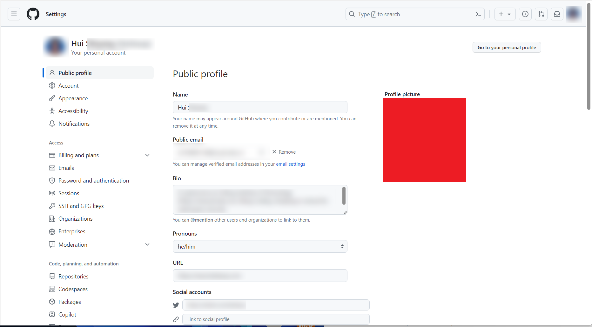
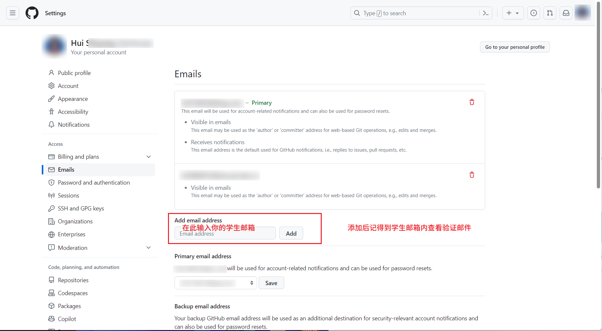
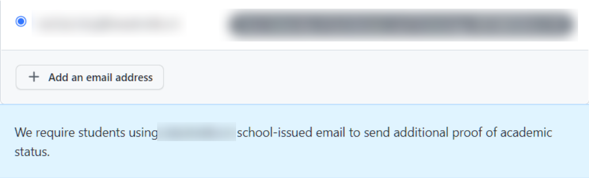
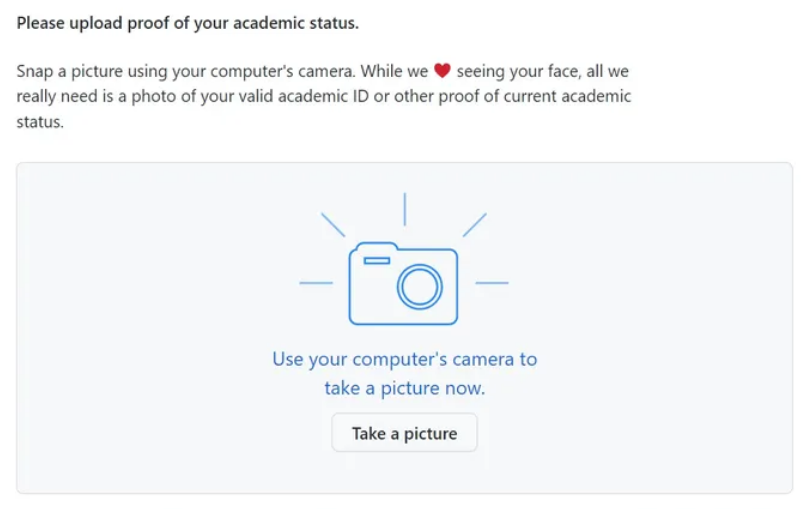
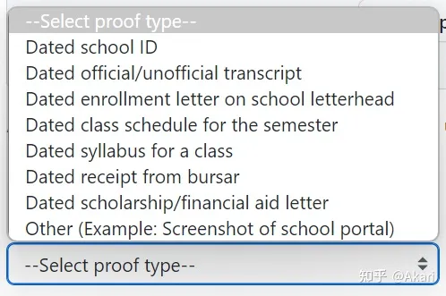
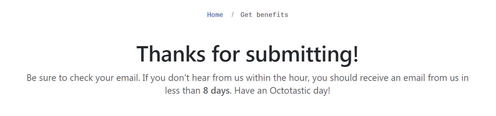

## 申请地址

[GitHub Student Developer Pack - GitHub Education](https://education.github.com/pack)

## 申请方式

首先需要有一个 Github 账号（先用自己的 QQ 邮箱或者常用的其他邮箱注册账号），并且登录 [Github](https://github.com)。

登录后点击右上角头像，接着点击 `Settings` ，进入设置页面。

在进入到的页面里将你的 `Name` 更改为你的**英文名**（拼音），将你的头像更改为你的**个人照片**，最好是与学生证上的照片一致。在 `Bio` 编辑框里写上你的**个人简介**（三个内容缺一不可），例如：

> A sophomore at Jinling Institute of Technology (https://www.jit.edu.cn/), liking Coding. Studying in school for cyberspace security.

修改完之后下拉保存（点击 `Update Profile`），在申请成功（收到成功邮箱后）**为了防止个人信息泄露，可以修改你的头像和昵称**。

接着在左侧菜单列表的 `Access` 里面找到 `Emails` 并点击打开，在 `Add email address` 中添加你的学校邮箱并验证。

验证好之后我们可以进入到上面提到的申请地址进行申请。

打开申请地址，登录你的 Github 账号，点击下方样式的按钮：

确认自己是学生，进入填写页面，按照要求填写信息（学校名将在你选择学校邮箱后自动填充）

注意在选择邮箱时**选择自己的学校邮箱**，否则不能申请，申请理由随便填写（最好用英文）。

在下一步骤上传图片，我们先不要自己点击按钮拍照，我们到学信网申请一个在线证明，然后保存成图片（可以截图），最后保存图片，**拖拽文件**上传到该页面。

学信网申请在线证明可以百度，在结果页面可以使用浏览器自带的翻译功能翻译成英文。

若有类型选择，可选择 `Other` 类型（因为我在续签的时候没有这个，所以随便找了张图）

最后提交即可。

等待结果邮件即可，成功后可以将 Github 个人信息修改。

以上步骤缺一都不能正常申请（个人信息是2023年的新坑，本人至少尝试了20多遍才通过）。