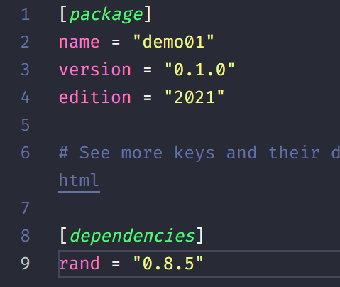
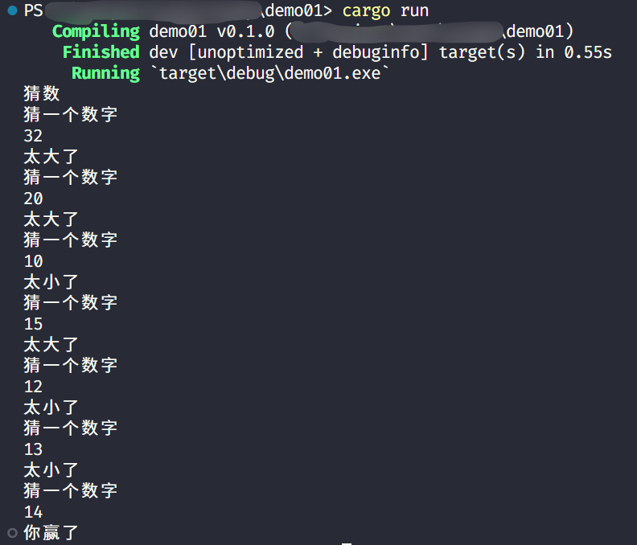
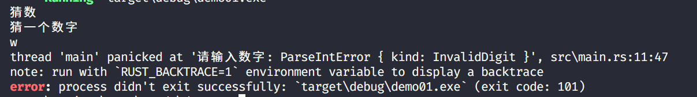

> 看的是 B 站 up “软件工艺师”的视频：https://www.bilibili.com/video/BV1hp4y1k7SV

## 起步

### 编写 Hello World

```rust
fn main() {
    println!("Hello World!");
}
```

与大部分编程语言一样，`Rust` 也有 `main` 函数，如上所示。而 `Rust` 的后缀名为 `.rs`，当我们需要编译运行简单的 `Rust` 程序，只需要命令行运行 `rustc`：

```bash
rustc helloworld.rs
```

此时同目录下会生成两个文件：`<同文件名>.pdb`、`<同文件名>.exe`。其中 `pdb` 带有调试信息，而 `exe` 为可执行程序，可直接运行。

当然，`rustc` 命令只适合小型项目或文件，若大型项目则需要 Cargo。

Cargo 是 `Rust` 的构建系统和包管理工具，安装 `Rust` 时默认是安装 Cargo 的。

### 使用 Cargo 创建项目

运行命令创建项目：

```bash
cargo new <项目名称>
```

使用 Cargo 创建项目会创建一个项目文件夹即项目名称，进入文件夹可以看到 Cargo 为我们创建了如下文件以及目录结构：

```
<项目名称>
├── Cargo.toml
└── src
    └── main.rs
```

除此之外还有一个 `.gitignore` 文件，为 git 的文件忽略配置文件，也就是说 Cargo 为我们初始化了 git 仓库。

`Cargo.toml` 为 Cargo 的配置文件，与 `nodejs` 中的 `package.json` 一样。

根据 Cargo 生成的目录结构来看，项目的源代码都应该放在 `src` 文件夹下，Cargo 为我们创建了一个 `main.rs` 文件。

### 使用 Cargo 编译项目

运行命令编译项目：

```bash
cargo build
```

运行此命令将创建可执行程序文件，第一次运行 `cargo build` 会在顶层目录生成 `cargo.lock` 文件，该文件不需手动修改。

上面命令生成可执行文件放在指定目录，如果我们想构建并运行项目，需要执行以下命令：

```bash
cargo run
```

若我们只需要检查代码，确保能通过编译，我们可以使用以下命令：

```bash
cargo check
```

该命令会检查代码文件是否能通过编译，并不会产生任何可执行文件。

如果我们需要进行发布的构建，需要在 `build` 命令加上参数：

```bash
cargo build --release
```

此命令在编译时会进行优化，但是编译时间会比开发版更长。

加不加这个参数的编译目录也有区别，开发版在 `target/debug`，发布版在 `target/debug`。

## 经典例子——猜数游戏

> ### 目标
>
> - 生成一个 `1` 到 `100` 间的随机数
> - 提示玩家输入一个猜测
> - 猜完之后 ，程序会提示猜测是太小了还是太大了
> - 如果猜的正确，那么打印出一个庆祝信息，程序退出

### 基本输入输出

```rust
use std::io;
fn main() {
    println!("猜数");
    println!("猜一个数字");
    let mut guess = String::new();
    io::stdin().read_line(&mut guess)
        .expect("无法读取行");
    println!("你猜的数字是: {}", guess);
}
```

上面的代码作用试试获取用户的输入。

`println!()` 作用就是打印一行内容，在 C 语言中，我们要想在打印内容中拼接变量，需要用到 `%` 占位符：`printf("数字为：%d", num);`，而在 `Rust` 中，我们使用的是 `{}`：`println!("你猜的数字是: {}", guess);`，而 `println!()` 是宏，不是函数。我们如果想要获取用户输入，需要引入标准库 `io`：`use std::io;`。

我们使用 `let` 声明变量，在 `Rust` 中，所有的变量默认都是不可变的，我们要想使其可变，就要跟上面的代码一样加上 `mun`：

```rust
let num = 1; // 不可变
let mut num2 = 1; // 可变
num2 = 3;
```

在上面的代码中 `String::new()` 新建了一个字符串类型实例，它是由标准库提供的，值为空的字符串。

再往下看，`io` 库中有一个函数 `stdin`，会返回类型  `Stdin` 的实例，它会被用作句柄（Handler）来处理终端中的标准输入。若我们不在文件开头引入 `io` 库，则需要这样写：

```rust
std::io::stdin().read_line(&mut guess).expect("无法读取行");
```

但是不推荐这样写。

通过 `read_line` 我们可以读取终端中用户的输入，因此我们需要传入我们的可变的字符串引用地址：`&mut guess`。引用地址默认也是不可变的，因此我们需要把它变为可变的，加上 `mut`。

当然，`read_line` 方法也是有返回值的，它的返回值类型为 `io::Result<usize>` 泛型，此方法的返回值通常有两种：`Ok` 和 `Err`，并且返回值通常会带上附加值，供我们进行使用，而 `io` 库中这个方法也为我们提供了处理方法，即 `expect`，当 `read_line` 返回 `Ok` 时，`expect` 会提取出 `Ok` 中附加的值，并将这个值作为结果返回给用户。

### 生成随机数

`Rust` 标准库没有生成随机数的方法，但是我们可以使用 `rand` 包，我们需要通过 Cargo  包管理进行安装，首先访问网站寻找库：[crates.io: Rust Package Registry](https://crates.io/)

找到 rand 包：[rand - crates.io: Rust Package Registry](https://crates.io/crates/rand)

发现最新版本为 `0.8.5`，那么在顶层目录的 `Cargo.toml` 文件内添加依赖：



上面这种写法就是指定了一个版本，当在版本号前面添加 `^` 代表着与该版本 API 兼容的版本，通常取与其兼容的最高版本：`“^0.8.5”`。

当我们执行 `cargo build` 时同时会下载库。如果我们不主动更新库，那么 Cargo 将会一直使用与代码兼容的库的版本。

若我们想要更新库，可以使用命令 `cargo update`，此时 Cargo 将忽略 `Cargo.lock` 文件直接检查 `Cargo.toml` 内的版本，并且更新到与之兼容的小版本的最新版本，例如我在 `Cargo.toml` 内写的版本为 `0.8.0`，那么其会帮我们更新到 `0.8.5` (`0.8.x` 中最新版)。其不会修改 `Cargo.toml` 文件，而是修改 `Cargo.lock` 文件，我们在更细完后可以看到 `Cargo.lock` 文件内的 `rand` 版本号为 `0.8.5`。

接下来我们使用 `rand` 包中的接口生成随机数：

```rust
// .. 其他代码
use rand::Rng; // 使用 rand  包
fn main() {
    // .. 其他代码
    let secret_number = rand::thread_rng().gen_range(1..=100); // 创建 1-100 随机数
    println!("秘密数字是: {}", secret_number);
    // .. 其他代码
}
```

版本 `0.8.0` 以后生成 1-100 随机数里面的参数不再是 `1, 101`，而是 `1..=100`。新版本用法如下：

`1..100`：左闭右开，即 `1~99`；`1..=100`：左闭右闭，即 `1~100`。

### 比较数字大小

我们需要从标准库中引入 `cmp` 的 `Ordering` 类型，它有三个值：`Less`、`Greater`、`Equal`，我们声明了变量 `guess` 并且读取用户输入，我们声明的变量有一个方法 `cmp`，它会与另外一个（传参）值进行比较（Compare），如果大于就返回 `Odering` 类型中的 `Greater`，小于就是 `Less`，等于就是 `Equal`。

但是我们定义的是一个字符串 `String` 类型，但是我们要比较的是整数类型，在 `Rust` 中有许多整数类型，`Rust` 也自带有类型推断，而我们写的变量赋值默认类型即为 `i32`，后面会讲到。

因此我们需要转换一下类型，最好把字符串转为整数类型：

```rust
let guess:u32 = guess.trim().parse().expect("请输入一个数字！");
```

因处理类型可以失败，因此需要使用 `expect` 处理。

我们之前已经声明了一个变量 `guess`，但是我们可以再次声明同名称变量来“隐藏（shadow）”旧变量，这一特性通常用在转换类型。

上面代码中，`trim` 用于去掉两端的空白，`parse` 进行类型转换。我们在声明变量时加上什么类型就转成什么类型。我们使用 `u32` 类型是因为 `Rust` 拥有类型推断功能，我们在后面用到 `guess` 时 `Rust` 推断出我们的 `guess` 取值在 `1` ~ `100`，因此自动推断类型为 `u32`（无符号整型）而非 `i32`，若我们只写到最开始的 `guess` 赋值，那么可以看到 `guess` 的类型为 `i32`。

接下来我们可以对两个数字进行比较：

```rust
use std::io;
use std::cmp::Ordering;
use rand::Rng;
fn main() {
    println!("猜数");
    println!("猜一个数字");
    let secret_number = rand::thread_rng().gen_range(1..=100);
    let mut guess = String::new();
    io::stdin().read_line(&mut guess)
        .expect("无法读取行");
    let guess:u32 = guess.trim().parse().expect("请输入数字");
    match guess.cmp(&secret_number) {
        Ordering::Less => println!("太小了"),
        Ordering::Greater => println!("太大了"),
        Ordering::Equal => println!("你赢了"),
    }
}
```

其中 `match` 的左右就好比 `switch`，它允许代码根据条件进行运行。事实上，`match` 就是用来枚举的。

### 允许多次猜测——循环

我们使用 `loop` 进行循环：

```rust
loop {
    // ... 执行代码
}
```

我们调整一下代码顺序，将程序生成的随机数放到循环外面，提示以及输入放到循环里面：

```rust
use rand::Rng;
use std::cmp::Ordering;
use std::io;
fn main() {
    println!("猜数");
    let secret_number: u32 = rand::thread_rng().gen_range(1..=100);
    loop {
        println!("猜一个数字");
        let mut guess = String::new();
        io::stdin().read_line(&mut guess).expect("无法读取行");
        let guess: u32 = guess.trim().parse().expect("请输入数字");
        match guess.cmp(&secret_number) {
            Ordering::Less => println!("太小了"),
            Ordering::Greater => println!("太大了"),
            Ordering::Equal => println!("你赢了"),
        }
    }
}
```

此时，我们可以一直进行猜测，程序也会一直进行反馈。

接下来我们就需要处理猜对跳出循环。与其他语言循环一样，`Rust` 跳出循环也是用的 `break`：

```rust
use rand::Rng;
use std::cmp::Ordering;
use std::io;
fn main() {
    println!("猜数");
    let secret_number: u32 = rand::thread_rng().gen_range(1..=100);
    loop {
        println!("猜一个数字");
        let mut guess = String::new();
        io::stdin().read_line(&mut guess).expect("无法读取行");
        let guess: u32 = guess.trim().parse().expect("请输入数字");
        match guess.cmp(&secret_number) {
            Ordering::Less => println!("太小了"),
            Ordering::Greater => println!("太大了"),
            Ordering::Equal => {
                println!("你赢了");
                break;
            }
        }
    }
}

```



### 处理报错

如果我们输入一个非数字字符，会出现如下报错：



还会看到我们在 `expect` 里面的提示内容“请输入数字”，若我们对错误进行处理而不是直接抛出错误使程序停止，那么就需要对返回内容使用枚举，之前提到过，`expect` 会返回两个内容：`Ok` 和 `Err`，因此我们可以对此进行枚举：

```rust
let guess: u32 = match guess.trim().parse() {
    Ok(num) => num,
    Err(_) => continue,
};
```

这样的语法与 `js` 中的箭头函数很像，也只是很像，其中 `continue` 即跳出**本次**循环。

## 基础语法

### 变量与可变性

- 声明变量使用 `let` 关键词
- 默认情况下，变量是不可变的（Immutable）
- 声明变量时，在变量前面加上 `mut`，就可以使变量可变。

> ### 变量与常量
>
> 常量（Constant）：常量在绑定值以后也是不可变的，但它与不可变的变量有很多区别：
>
> - 不可以使用 `mut`，常量永远都是不可变的
>   - 声明常量使用 `const` 关键字，它的类型必须被标注
>   - 常量可以在任何作用域内进行声明，包括全局作用域
>   - 常量只可以绑定到常量表达式，无法绑定导函数的调用结果或只能在运行时才能计算出的值
> - 在程序运行期间，常量在其声明的作用域内一直有效
> - 命名规范：`Rust` 里常量使用全大写字母，每个单词之间用下划线分开，例如：`MAX_POINTS`

### 隐藏（遮蔽）

在 `Rust` 里可以使用相同的名字声明新的变量，新的变量就会 shadow （隐藏，遮蔽）之前声明的变量：

```rust
fn main() {
    let x = 5;
    let x = x + 1;
    let x = x * 2;
    
    println!("The value of x is {}", x); // 12
}
```

shadow 和把变量标记为 `mut` 是不一样的：

- 如果不使用 `let` 关键字，那么重新给非 `mut` 的变量赋值会导致编译时错误
- 使用 `let` 声明的同名新变量，也是不可变的
- 而使用 `let` 声明的同名新变量，它的类型可以与之前不同

### 数据类型

#### 标量和复合类型

`Rust` 是静态编译语言，在编译时必须知道所有变量的类型

- 基于使用的值，编译器通常能够推断出它的具体类型
- 但如果可能的类型比较多（例如把 String 转为整数的 parse 方法），就必须添加类型的标注，否则编译会报错。

#### 标量类型

一个标量类型代表一个单个的值

`Rust` 有四个主要的标量类型：

- 整数类型

  - 整数类型没有小数部分

  - 整数可以**用下划线切割**方便阅读，例如 `12000` 可以写为 `12_000`，没有影响

  - 例如 `u32` 就是一个无符号的整数类型，占据 32 位的空间

  - 无符号整数类型以 `u` 开头

  - 有符号的整数类型以 `i` 开头

  - `Rust` 的整数类型列表如下：

    | 长度    | 有符号 | 无符号 |
    | ------- | ------ | ------ |
    | 8-bit   | i8     | u8     |
    | 16-bit  | i16    | u16    |
    | 32-bit  | i32    | u32    |
    | 64-bit  | i64    | u64    |
    | 128-bit | i128   | u128   |
    | arch    | isize  | usize  |

    - 每种都分 `i` 和 `u`，以及固定的位数

    - 有符号范围：

      $-2^{n-1}$ 到 $2^{n-1}-1$

    - 无符号范围：

      $0$ 到 $2^n-1$

    - `isize` 和`usize` 类型

      `isize` 和 `usize` 类型的位数由程序运行的计算机的架构所决定：

      - 如果是 64 位计算机，那就是 64 位的
      - ……

      使用 `isize` 或 `usize` 的主要场景是对某种集合进行索引操作。

  - 整数字面值

    | 进制                    | 例子        |
    | ----------------------- | ----------- |
    | 十进制 `Decimal`        | 98_222      |
    | 十六进制 `Hex`          | 0xff        |
    | 八进制 `Octal`          | 0o77        |
    | 二进制 `Binary`         | 0b1111_0000 |
    | 字节 `Byte` (仅限 `u8`) | b’A’        |

    - 除了 `byte` 类型外，所有的数值字面值都允许使用类型后缀，例如 `57u8`，`57` 为整数，`u8` 为类型。
    - 如通不太清楚应该使用哪种类型，可以使用 Rust 相应的默认类型：
      - 整数的默认类型就是 `i32`；`i32` 总体上来说速度很快，即使在 64 位系统中。

  - 整数溢出

    例如：`u8` 的范围是 `0~255`，如果把 `u8` 的变量的值设为 `256`，那么：

    - 调试模式下编译：`Rust` 会检查整数溢出，如果发生溢出，程序在运行时就会 panic
    - 发布模式下（--release）编译：`Rust` 不会检查可能导致 panic 的整数溢出
      - 如果溢出发生：`Rust` 会执行“环绕操作”：`256` 变成 `0`，`257` 变成 `1` ……
      - 但程序不会 panic

- 浮点类型

  - `Rust` 有两种基础的浮点类型，也就是含有小数部分的类型
    - `f32`，32 位，单精度
    - `f64`，64 位，双精度
  - `Rust` 的浮点类型使用了 IEEE-754 标准来表述
  - `f64` 是默认类型，因为在现代 CPU 上 `f64` 和 `f32` 的速度差不多，而且精度更高。

  ##### 数值操作

  加、减、乘、除、取余略。

- 布尔类型

  `bool`

- 字符类型

  - `Rust` 中 `char` 类型被用来描述语言中最基础的单个字符。
  - 字符类型的字面值使用单引号
  - 占用 4 字节大小
  - 是 Unicode 标量值，可以表示比 ASCII 多得多的字符内容：拼音、中日韩文、零长度空白字符、emoji 表情等。
    - `U+0000` 到 `U+D7FF`
    - `U+E000` 到 `U+10FFFF`

#### 复合类型

- 复合类型可以将多个值放在一个类型里。
- `Rust` 提供了两种基础的复合类型：元组（Tuple）、数组

##### Tuple

`Tuple` 可以将多个类型的多个值放在一个类型里

`Touple` 的长度是固定的，一旦声明就无法改变

###### 创建 Tuple

- 在小括号里，将值用逗号分开
- `Tuple` 中的每个位置都对应一个类型，`Tuple` 中各元素的类型不必相同

```rust
fn main() {
    let tup: (i32, f64, u8) = (500, 6.4, 1);
    println!("{}, {}, {}, ", tup.0, tup.1, tup.2);
}
```

###### 获取 Tuple 的元素值

- 可以使用模式匹配来解构（destructure）一个 Tuple 来获取元素的值

  ```rust
  fn main() {
      let tup: (i32, f64, u8) = (500, 6.4, 1);
      // 解构赋值
      let (x, y, z) = tup;
      
      println!("{}, {}, {}, ", x, y, z);
  }
  ```

###### 访问 Tuple 的元素

- 使用点标记法，例如第一个元素就为 `变量.0`，第二个元素为 `变量.1`

##### 数组

- 数组也可以将多个值放在一个类型里
- 数组中每个元素的类型必须相同
- 数组的长度也是固定的，一旦声明之后不能边长也不能变短
- 如果想让数据存放在 stack（栈）上面而不是 heap（堆）上面，或者想保证有固定数量的元素，这时使用数组更有好处
- 数组没有 Vector 灵活（后面提到，实际 Vector 用的更多）
  - Vector 和数组类似，它由标准库提供
  - Vector 的长度可以改变
  - 如果不确定该用数组还是 Vector，那么就应该使用 Vector

###### 声明数组

```rust
let a = [1, 2, 3, 4, 5];
```

###### 数组的类型

- 数组的类型以这种形式表示：[类型; 长度]

  - 例如：`let a: [i32; 5] = [1, 2, 3, 4, 5];`

  ###### 另一种声明数组的方法

  - 如果数组的每个元素值都相同，那么可以在：
    - 在中括号里指定初始值
    - 然后是一个“`;`”
    - 最后是数组的长度
  - 例如：`let a = [3; 5];` 它就相当于：`let a = [3, 3, 3, 3, 3];`

###### 访问数组的元素

- 数组是 Stack 上分配的单个块的内存

- 可以使用索引来访问数组的元素

  ```rust
  let months = [ "January", "February", "March", "April", "May", "June", "July", "August", "September", "October", "November", "December" ];
  
  let first = months[0];
  
  let second = months[1];
  ```

- 如果访问的索引超出了数组的范围，那么：
  - 编译可能会通过
  - 运行会报错（runtime 时会 panic）
    - Rust 不会允许其继续访问相应地址的内存

### 函数

#### 函数的声明

- 声明函数使用 fn 关键字

- 依照惯例，针对函数和变量名，Rust 使用 snake_case 命名规范：

  - 所有的字母都是小写的，单词之间用下划线分开：

    ```rust
    fn main() {
        println!("hello world");
        another_function();
    }
    
    fn another_function() {
        println!("Another function");
    }
    ```

#### 函数的参数

- parameters（定义函数的形参）, arguments（传入函数的实参）

- 在函数签名里，必须声明每个参数的类型：

  ```rust
  fn main() {
      another_function(5, 6);
  }
  fn another_function(x: i32, y: i32) {
      println!("the value of x is: {}", x);
      println!("the value of y is: {}", y);
  }
  ```

#### 函数体中的语句与表达式

- 函数体由一系列语句组成，可选的由一个表达式结束

- Rust 是一个基于表达式的语言

- 语句是执行一些动作的指令

- 表达式会计算产生一个值

  ```rust
  fn main() {
      let y = 6; // 这是一个语句
  } // 整个函数的定义也是一个语句
  ```

- 函数的定义也是语句

- 语句不返回值，所以不可以使用 `let` 将一个语句赋给一个变量

  ```rust
  let x = (let y = 6);
  ```

  这样写会报错，因为第一个等号右边不是表达式而是语句，语句不返回值（这与 C 语言不同），实际上语句返回的是一个空的 Tuple `()`。

表达式是语句的组成部分，表达式有一个值，例如 `let a = 3 + 5;` 其中等式右边的就是一个表达式，而 `5` 这个字面值本身就是一个表达式，对应的值为 `5`。**调用函数也是一个表达式**，调用宏（例如 `println` ）也是一个表达式，下面代码中的代码块也是一个表达式：

```rust
fn main() {
    let x = 5;
    
    let y = {
        let x = 1;
        x + 3
    }
    
    println!("The value of y is: {}", y);
}
```

上面代码中我们声明了一个 `y`，等号右边为一个代码块，代码块中最后一行没有分号，因此这个代码块的值就为最后一个表达式执行后返回的值。

**但是**如果我们在 `x + 3` 后加上一个 `;`，那么此代码块就是一个语句，没有返回值。

#### 函数的返回值

- 在 `->` 符号后面声明函数返回值的类型，但是不可以为返回值命名
- 在 Rust 里面，返回值就是函数体里面最后一个表达式的值
- 若想提前返回，需使用 `return` 关键字，并指定一个值
  - 大多数函数都是默认使用最后一个表达式作为返回值

```rust
fn five() -> i32 {
    5
}

fn plus_five(x: i32) -> {
    x + 5;
}

fn main() {
    let x = five();
    let y = five(6);
    
    println!("The value of x is: {}", x);
    println!("The value of y is: {}", y);
}
```

上面调用 `five` 函数的返回值为 `5`，因此 `x` 的输出就为 `5`。调用 `plus_five` 函数传入参数值为 `6`，函数中最后一个表达式值为 `11`，函数返回值就为 `11`，因此 `y` 为 `11`。

最后一个表达式后面不能加分号，否则就为一个语句，返回类型就为 Tuple，与我们指定的 `i32` 冲突。

### 注释

```rust
// 单行注释

/* 多行
   注释 */
```

后面会讲到文档注释

### 控制流

#### `if` 表达式

- 跟许多其他语言不一样的是，Rust 中的 `if` 表达式条件必须是 `bool` 类型。

```rust
fn main() {
    let number = 7;
    if number < 5 {
        println!("condition was true");
    } else {
        println!("condition was false");
    }
}
```

如果使用多于一个 `else if`，那么最好使用 `match` 来重构代码。

```rust
fn main() {
    let x = 3;
    match x % 4 {
        0 => println!("x is divisible by 4"),
        1 => println!("x % 4 = 1"),
        2 => println!("x % 4 = 2"),
        3 => println!("x % 4 = 3"),
        _ => println!("x % 4 = ?"),
    }
}
```

##### 在 `let` 语句中使用 `if`

- 因为 `if` 是一个表达式，所以可以将它放在 `let` 语句中等号的右边

  ```rust
  fn main() {
      let condition = true;
      let number = if condition { 5 } else { 6 };
      println!("The value of number isL {}", number);
  }
  ```

#### 循环

##### `loop` 循环

- `loop` 关键字告诉 Rust 反复地执行一块代码，直到你喊停。

- 可以在 `loop` 循环中使用 `break` 关键字来告诉程序何时停止循环。

  ```rust
  fn main() {
      let mut counter = 0;
      
      let result = loop {
          counter += 1;
          if counter == 10 {
              break counter * 2;
          }
      }
      
      println!("The result is : {}", result);
  }
  ```

  最终输出结果为 `20`。

##### `while` 条件循环

- `while` 条件循环每次执行循环体之前都判断一次条件

```rust
fn main() {
    let mut number = 3;
    
    while number != 0 {
        println!("{}!", number);
        
        number = number - 1;
    }
    
    println!("LIFTOFF!!!");
}
```

##### `for` 循环

```rust
fn main() {
    let a = [10, 20, 30, 40, 50]l
    for element in a.iter() {
        println!("the value is: {}", element);
    }
}
```

下面例子实现倒计时：

> Range 由标准库提供，指定一个开始数字和一个结束数字，Range 可以生成它们之间的数字（不含结束），例如 `let x = 1..4;`，就会生成从 `1` 到 `3` 的 Range，`rev` 方法可以反转 Range，例如 `let x = (1..4).rev();` 为从 `3` 到 `1`，与前面那个成反转关系。

```rust
fn main() {
    for number in (1..4).rev() {
        println!("{}!", number);
    }
    println!("LIFTOFF!");
}
```

