## 前提

面向低基础的同学的教程。给学弟学妹们看的。

### NodeJS 环境

#### 安装

搭建 Hexo 博客需要 NodeJS 环境。

> ##### 什么是环境？（如果你的时间很宝贵，或者你有基础，可以直接跳过解释）
>
> 一言以蔽之，即你的作品运行起来需要的“软件”。
>
> 这种软件比较特殊，一般来说是没有“图形化”界面的，但是会在你看不到的地方为你默默付出，把你写的东西经过它的处理变成计算机或者其他软件能够识别的文件。
>
> 我们编写 Hexo 博客，就需要一种环境，让我们写的东西变成浏览器能够认识的网页文件。
>
> 因此我们首先要搭建好 NodeJS 环境。

你可以去正规途径搜索 NodeJS 并下载，不过建议去 NodeJS 的官网下载安装：[NodeJS官网](https://nodejs.org/zh-cn)。

官网页面给了两种版本下载：**LTS长期维护版**和**尝鲜版**，如果你后期不打算接触 NodeJS 学习的话，选择哪个版本都是可以的。这里以最新版作为教程。

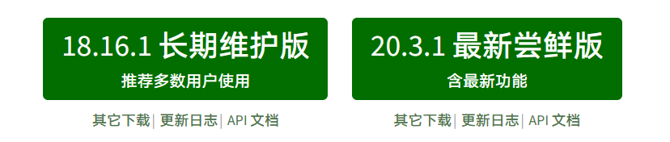

下载后按照默认指引安装即可（安装位置可以自定义）。如果是 MacOS 或者 Linux 的话可能安装方法有些许不同，按照官方给的安装方法进行安装。

#### 检验

安装完之后我们要检验我们的 NodeJS 是否安装成功。

- 如果你的电脑系统是 Windows，按下键盘上的 `⊞Windows` 和 `R` 键，打开一个如下的运行窗口：

    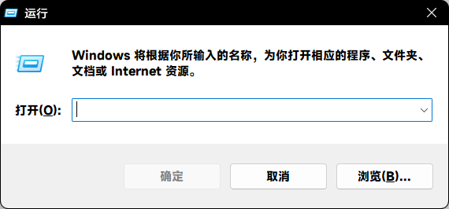

    在输入框内输入 `cmd` 并且点击确定或者回车，会打开一个命令行窗口，如下图所示：

    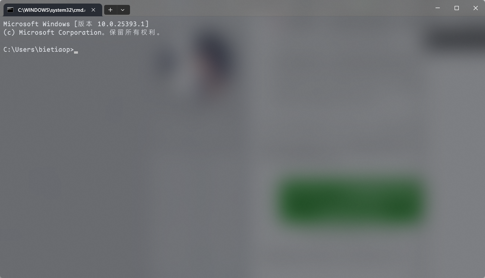

- 如果你的电脑系统是 Linux 或者 MacOS，打开终端软件即可。

- 如果是其他系统，在安装完之后打开相应的终端软件。

打开终端（命令行）后，输入 `node -v`，按下回车，接着输入 `npm -v`，按下回车，如果安装成功将会显示 `node` 和 `npm` 的版本号：

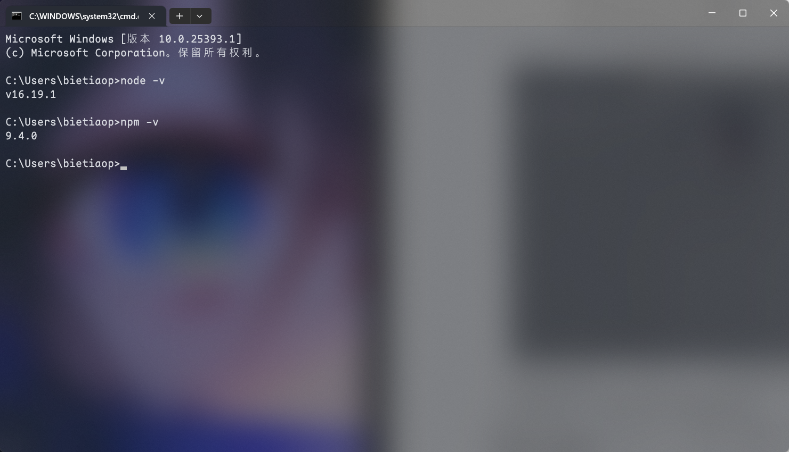

### Hexo 环境

在安装完 NodeJS 之后，通过 NodeJS 安装 Hexo 依赖，运行以下命令：

```bash
npm install hexo-cli -g
```

安装完成后我们可以通过 `Hexo Cli` 工具进行博客项目的指令创建。

#### 验证安装

与验证 NodeJS 是否安装成功类似，执行 `npx hexo -v`，如果显示一大堆东西加上各自的版本号，说明安装成功。

### 特殊情况

注意，如果你的 `npm` （NodeJS 包管理）安装命令安装依赖都很慢的话，可以尝试修改安装镜像源（阿里或者清华），也可以使用 `cnpm`。

没有安装慢的问题可以跳过。

#### npm 设置镜像的方法（仅通过 npm 自带指令）

通过命令配置镜像（淘宝，其他类似）

```bash
npm config set registry https://registry.npmmirror.com/
```

如果不确定镜像是否设置成功，可以执行如下命令查看已配置的镜像地址：

```bash
npm config get registry
```

如果显示的为你设置的地址（这里为 `https://registry.npmmirror.com/`），那么就表示设置成功了。

如果想切回默认的镜像地址，将设置镜像指令的地址替换为 `https://registry.npmjs.org` 即可。

其他方法可以参考这篇文章：[npm设置镜像的方法（包含切换国外国内镜像源）](https://blog.csdn.net/weixin_45182409/article/details/117981169)

注意，淘宝已经把 npm 镜像地址从 `https://registry.npm.taobao.org` 迁移到了 `https://registry.npmmirror.com/`，上面 CSDN 博客里提到的淘宝镜像已经过时。

## 新建博客项目

首先新建一个文件夹用于存放项目文件，后面将通过指令来创建博客文件夹。

创建项目文件夹是为了养成良好的习惯，将自己的项目分类放进项目文件夹有利于我们后期快速定位到项目文件。

如果你已经有自己的项目文件夹，就需要在里面再新建一个文件夹了，我们打开项目文件夹，在文件夹处打开终端（命令行），如果你是 Linux 系统+GUI界面，可以通过鼠标右击，选择在当前文件夹打开终端，如果你是 Windows 系统，可以通过 cd 命令进入文件夹，但是有简洁的方法：在文件资源管理器地址栏输入 cmd 并回车：

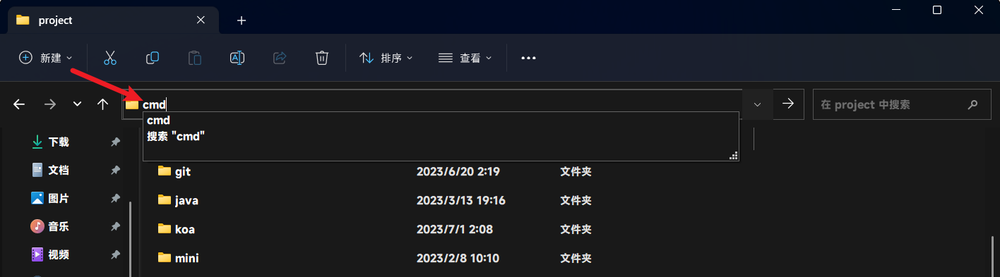

就会在当前文件夹打开命令行（说法可能误导，其实是将命令行执行的目标文件夹转到当前文件夹）

打开命令行后运行以下命令（将博客文件夹名称替换成你想要的名称，不要带上尖括号，它会新建一个你指定名称的文件夹）：

```bash
hexo init <博客文件夹名称>
# 如果上面的命令提示未找到命令 hexo (通常是Linux系统)，那么执行如下指令：
npx hexo init <文件夹名称>
# 后面出现相同情况不再赘述
```

它会克隆一个 Github 仓库，因此速度取决于你连上 Github 的速度，如果失败多尝试即可。（因为国内连接 Github 是不稳定的）。如果你之前执行过 Hexo 的创建指令，在克隆仓库失败的时候会提示你使用本地的缓存，如下图所示：

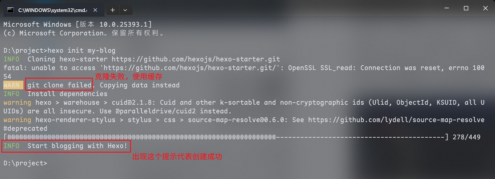

接着你会发现原来的项目文件夹里面多了个刚刚创建的文件夹：

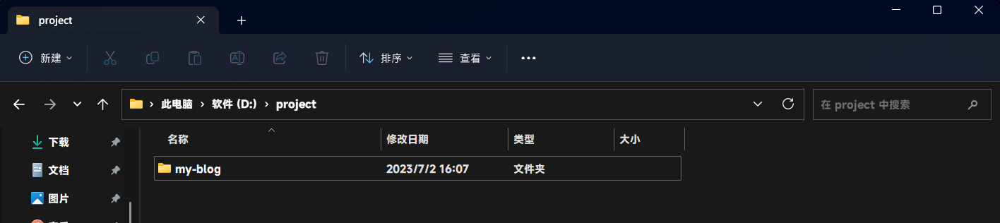

你可以进入这个文件夹再按照之前的方法在博客文件夹打开终端，也可以在刚刚的终端窗口执行指令进入文件夹，具体指令为：

```bash
cd <文件夹名>
```

这样就进入到了博客文件夹。

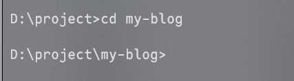

至此，新建一个博客项目成功。

## 初始化博客环境

我们创建完博客项目之后，需要初始化该项目的博客环境，在上面的博客文件夹的终端中执行以下命令：

```bash
npm install
# 如果你安装了 yarn，可以使用以下命令：
yarn install
```

执行这个命令会初始化博客项目文件夹的博客环境：

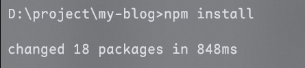

如果没有报错就说明环境依赖全部安装成功。

## 尝试运行本地博客服务

在初始化博客环境之后，我们可以尝试运行起来我们的博客服务器，看看是否安装成功，我们需要执行以下命令：

```bash
hexo s
```

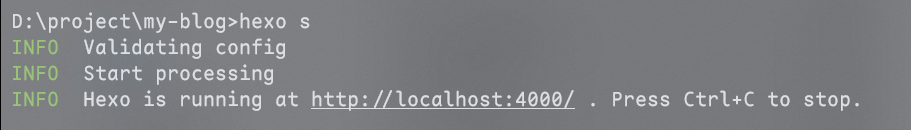

如果运行成功会出现以上提示，它会提醒你服务器地址为 `http://localhost:4000/` 这个本地服务器地址。

此时在浏览器输入这个地址即可看到我们的博客。

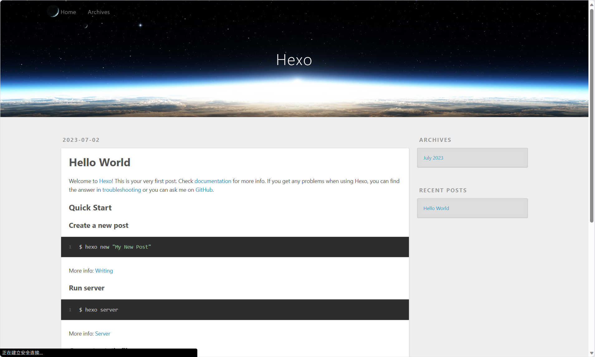



1. 端口占用

    端口占用的话可以使用运行参数来指定端口，在运行命令后加上 `--port=端口号` 即可。

    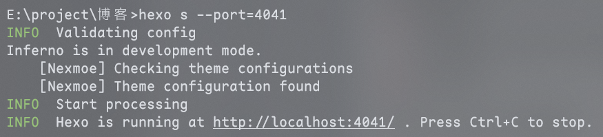

2. 依赖不完整

    再执行 `npm install` 安装依赖，确保没有报错（warn 可以忽略）。



至此，博客的基本搭建已经完成，下面将介绍进一步的使用，包括设置站点信息、撰写文章、修改主题。

## 撰写一篇简单的文章

当我们运行起来博客的时候，发现首页展现的是一篇标题为”Hello World“的文章，这是由 Hexo 自动生成的一篇文章，我们可以先从修改这篇文章的内容开始入手。

首先我们要知道的是，我们的文章使用 Markdown 编写，Hexo 会帮我们把 Markdown 文件转为带样式格式的网页文件。而我们要编写的 Markdown 文件存放在 `博客目录/source/_posts` 文件夹下，而 `source` 文件夹存放的是静态文件。如何理解呢？

我们可以认为 `source` 文件夹里面存放的就是网站文件，我们可以把一些浏览器能够识别的文件如图片、CSS、JS等放在该文件夹下，Hexo 处理时，不会对这些文件进行转义修改，而会原封不动地放到生成的网站文件夹内。

例如我有一个 `background.png` 文件放到了 `source` 文件夹下，生成博客网站文件时，`background.png` 会被放到生成的网站文件夹的根目录下。再如我有一个 `custom.css` 放到了 `source/style/` 文件夹下，那么这个文件最终会被放到 `生成的网站文件夹/style/custom.css`。

因此，我们可以放一些我们需要的静态文件供我们使用，引用的路径用**绝对路径**，但是这个绝对路径的根目录是 `source` 文件夹。这一点非常有用，我们在后面可能会需要存放一些静态文件使用，如果你现在不理解没有问题，以后会遇到的。

但是在 `source` 文件夹内有一个比较特别的文件夹——`_posts` 文件夹，这个文件夹里面存放我们的博客内容，这个文件夹里面的 markdown 文件会被特殊处理，最后放到一定格式的帖子文件夹目录。

值得注意的是，`source` 文件夹内的所有 markdown 文件（特殊设置的除外）都会通过 Hexo 处理生成一定格式的网页文件，具体设置后面会提到。

如果以上文字你很难理解的话，不要着急，慢慢来，用到的时候自然会懂的，文字还是比较难以理解的。

我们首先尝试修改自动生成的 Hello World 文章，打开 `_posts` 文件夹，会发现里面有一个 Markdown 文件，文件名为 `hello-world.md` ，这个就是自动生成的文章了，我们打开它，看看里面的结构。对于 Markdown，可以去网上看一些基本教程，这个东西很简单的，看了就会。对于编写用的编辑器，我个人更倾向于 Typora。

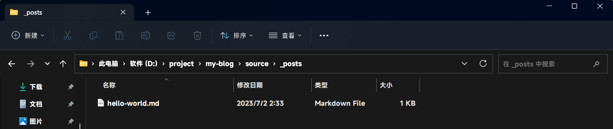

使用 Typora 打开后会看到如下的预览页面：

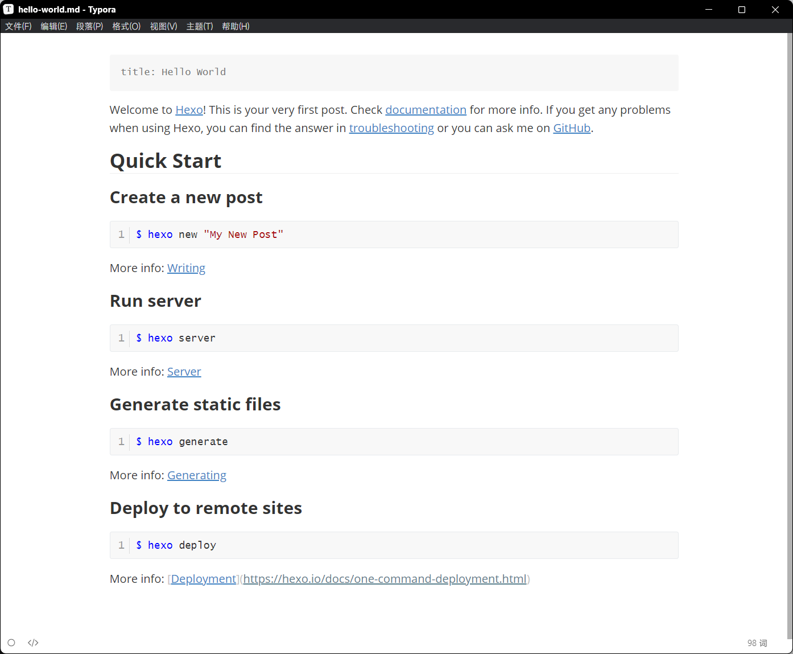

内容与我们博客网页上的一致，但是样式有区别，因为这是 Typora 编辑器，它与 Hexo 没有半毛关系，跟你的记事本文本编辑器一样，只不过自带了一些功能和主题。

我们可以通过点击右下角第二个按钮 `</>` 按钮查看原始内容：

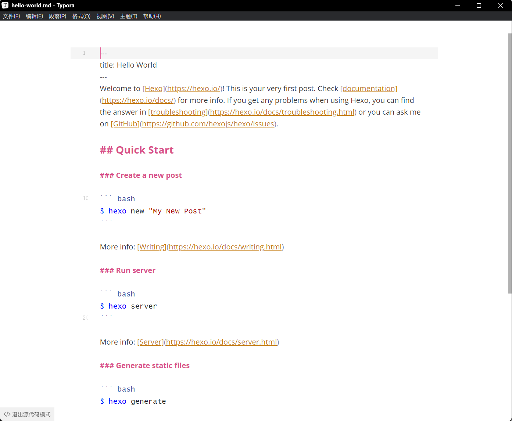

可以看到非常标准的 Markdown 内容，最上面有三个横线，注意，这三个横线是成对出现的：第一行和第三行。

这对横线通常放在文件开头，横线里放的是这篇文章的配置，例如文章标题、封面、发布时间、修改时间、关键词、分类、标签等。具体后面会提到。我们现在的目标是修改内容，看看有什么变化。

这里我把二级标题“Quick Start”修改为“快速开始”：

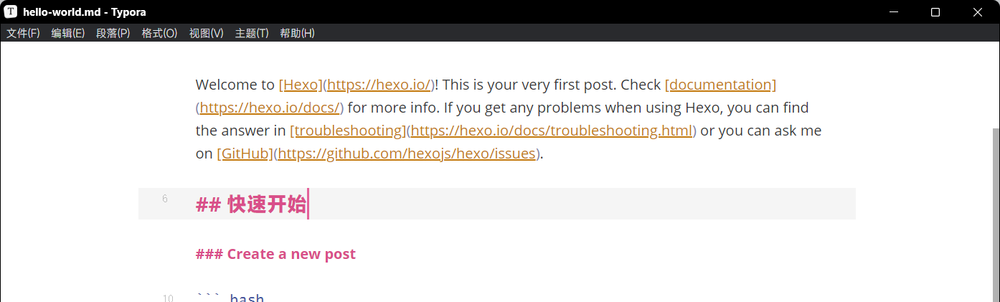

我们切换回 Typora 的预览模式，可以发现 Typora 的预览已经生效：

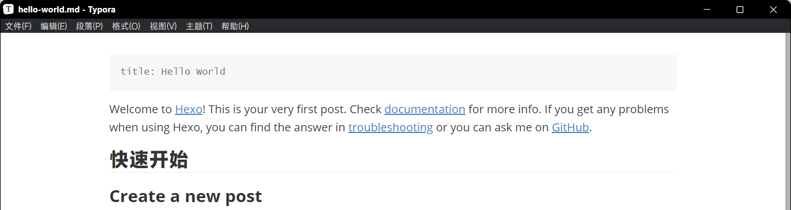

现在我们回到刚刚的博客网页，刷新页面，发现博客内容也相应地修改了：

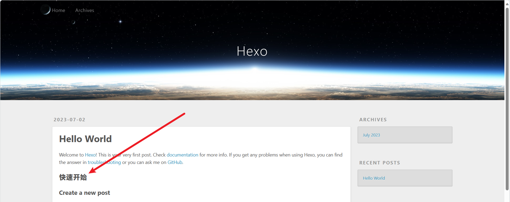

至此，赢！我们修改了 Hello World 文章，至少在内容编辑方面，我们已经学会了。

接下来就是新建一篇文章！

上面提到了文章的配置写在一对的三个横线内，也就意味着我们可以自己新建一个 md 文件，将配置写在对应位置，然后下面再写文章内容，不就可以了吗？没错！你很聪明！这样是可行的！而且标题跟文件名**没有关系**，文件名只是对应的网页的目录地址，你的文章标题包括检索用的标题都是写在配置里的。你可以看看 Hello World 这篇文章，文件名是 `hello-world.md`，但是它在 md 文件夹里配置了 `title` 文章标题，因此你看到的是 `Hello World` 而非 `hello-world`，而当你点击网页上的这个标题的时候会跳转到文章页，此时浏览器目录地址变成了 `hello-world`：

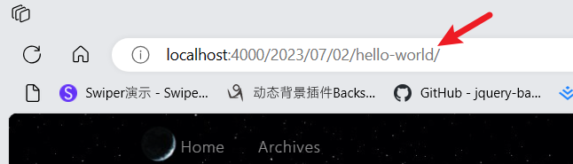

至于前面的日期就是我前面说的 <u>Hexo 给 `_posts` 文件夹里的 Markdown 文件的特殊处理</u>。放在 `_posts` 文件夹外的markdown 仅仅转为网页文件，地址中的字符还是 markdown 的文件名。

了解了这些，我们就可以从 0 手动新建一篇文章，这样固然不错，但是 Hexo 给我们一个更简便的方法：使用指令新建文章

```bash
hexo new [layout] <title>
```

其中 `layout` 是可选配置，默认为 `post`，这个 `layout` 是布局的意思，你可以理解为使用模板。模板文件存放在与 `source` 文件夹同级的 `scaffolds` 文件夹内，默认有三个布局：`draft`、`page`、`post`。对应着三种模板：草稿、页面、文章，默认为文章。布局有什么用，后面会提到。

`title` 就是我们的文章标题了，我们**在博客根目录**运行这个指令，看看效果（注意：因为我们已经开启了本地服务器，占用了命令行，我们可以再打开一个，不冲突的）。

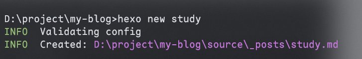

它会告诉我们文件存放的位置，我们可以打开文件看看内容：

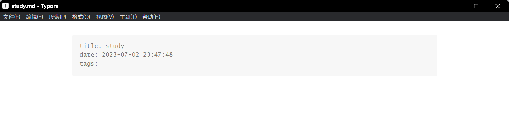

文件默认给我们写了三个配置：标题、日期和标签。

我们可以修改这些配置，例如给这个文章两个标签：

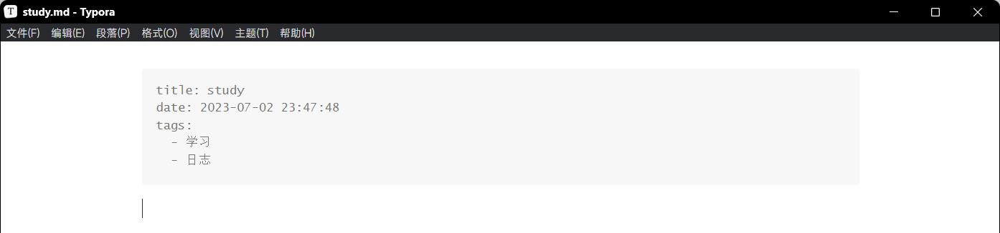

这里面的配置也是用的 yaml 格式，先提一嘴，我们的博客配置文件为 `_config.yml` ，这个文件就是一个 yaml 文件，里面的内容遵循 yaml 格式，可以了解一下这种格式，方便我们写配置。

接着我们可以在文件里写点内容，看看效果：

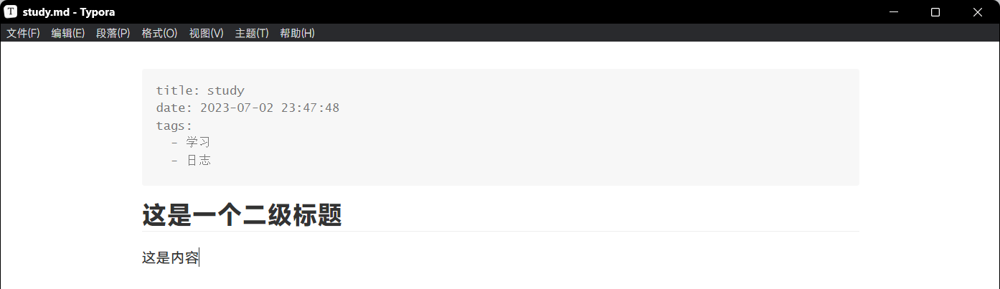

写完之后保存，回到博客网页首页，刷新页面。

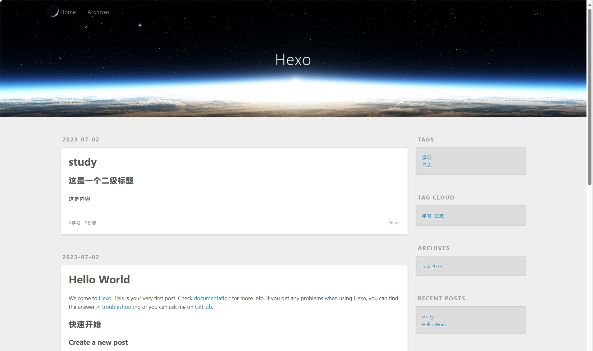

可以看到我们写的内容生效了，标题为 study，内容也是一样的，并且最下面还有两个我们配置的标签，这个标签的作用就类似于关键词可以检索使用。

除此之外，还有很多配置，具体可以参考：[官方文档 - Front-matter | Hexo](https://hexo.io/zh-cn/docs/front-matter)。

至此我们撰写博客就已经学会了，下面填坑，说说什么是布局（模板）。

### 拓展

这里的模板就是字面意思的模板，模仿某个模板文件生成一个有着一定固定格式的文件，打开 `scaffolds` 文件夹，可以看到布局的模板文件，打开后发现里面只写了我们之前提到的文章配置，并且配置内容为双引号括起来的，这里面的内容叫做“**变量**”，我们使用指令创建文档的时候，这些变量会按照一定的格式被填充，比如说 `{{ title }}` 会被填充为我们的页面标题，`{{ date }}` 会被填充为创建时间。默认模板的说明可以参考官方文档：[写作 | Hexo](https://hexo.io/zh-cn/docs/writing)。

就如我之前提到的，我们可以在 `source` 文件夹下放一个 markdown 文件，并且这个文件会被生成网页文件，而且路径跟 `_posts` 文件夹下的不同，不会经过文章的特殊处理（例如加上日期路径），因此我们可以通过这种方式创建一个没有文章格式的单页面。当我们对这种页面需求多的时候，而且需要一种固定格式，此时我们就可以写一个布局（模板）文件，方便我们创建类似的页面。

对于写布局文件我就不多说了，在拓展里我说一说不被当做文章处理的 markdown 文件通常会被怎么使用。

首先我们在 `source` 文件夹下创建一个 `about.md` 文件，文件内容如下：

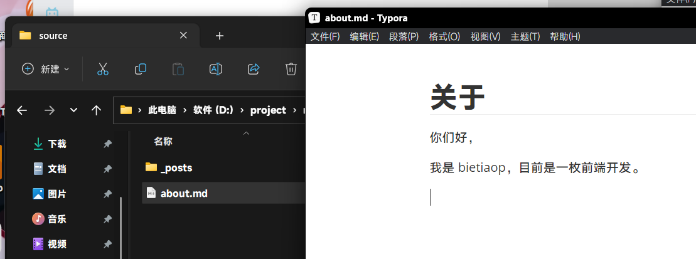

现在我们保存这个文件。没有感觉到什么变化。并且首页文章也不列出来这个文件。

不要着急，此时我们给路径加上 `about.html`。

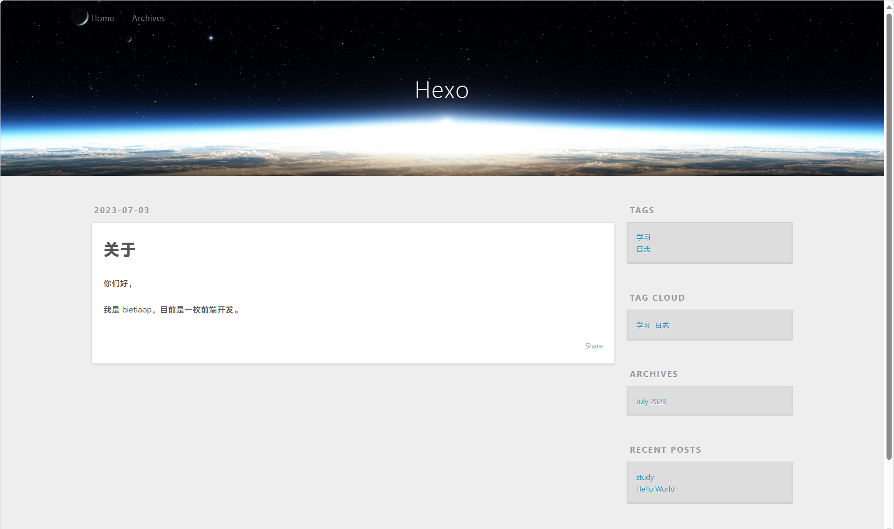

可以看到，我们写的内容会被展示出来，但是并没有放到首页的文章列表里。这是因为它不被当做博客文章处理！

而且路径跟之前提到的 `Hello World` 文章不同，这里并没有日期前缀路径。

好滴，这有啥用呢？我们可以通过这个创建几个子页面，可以是关于，可以是友情链接，可以是收藏夹等等。如果懂点前端，还可以自己写模板 HTML 文件，通过 `layout` 配置做出来一个突破这个文章样式的页面，比如说不显示那个 `Hexo` 等等。

值得一提的是，很多主题都带有这些功能，我们在使用主题的时候参考主题文档就可以实现了！我们无需重复造轮子。

## 配置博客

当前博客内容并不是我们想要的，我们还没有配置博客站点名称，它默认是大大的 `Hexo` ！

配置博客的文件在博客根目录的 `_config.yml` 文件里：

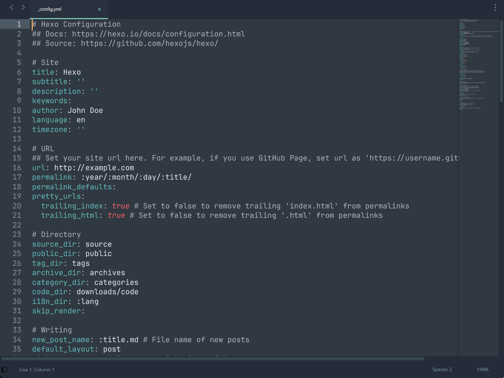

可以看到基本的配置，例如标题、副标题、简介、作者、语言等。

我们按需配置，这里不再赘述。配置详情参考：[配置 | Hexo](https://hexo.io/zh-cn/docs/configuration)。

这里我以修改标题、副标题作为演示，我们将其修改为如下内容：

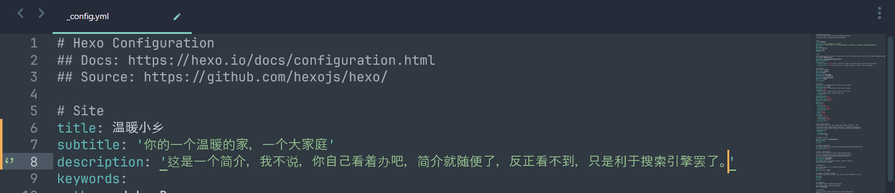

修改完成后我们需要重启本地服务器，在命令行按下 `Ctrl` + `C` 来停止当前服务。

然后再次执行启动服务，刷新页面。可以看到我们修改的配置生效了。

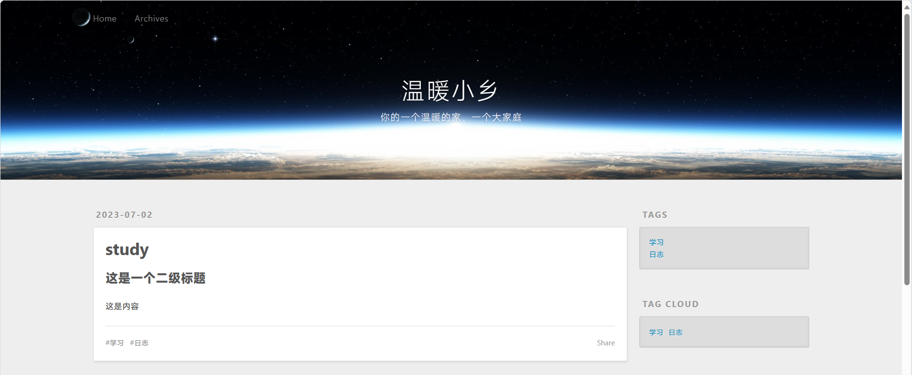

至于 `description` 简介，这是利于搜索引擎的，搜索引擎在检索后显示的网页简介。我们**修改配置文件**后一定要重启服务后刷新页面才能生效。

再提醒一次，详细配置请参考：[配置 | Hexo](https://hexo.io/zh-cn/docs/configuration)

我们的 Hexo 博客的默认主题为 `Landscape`，每个主题都有自己的配置文件，因此你在 `_config.yml` 同一目录可以看到 `_config.landscape.yml` 的配置文件，这里是主题的配置，我们安装其他主题也用同样的方法进行配置。配置文件的命名规则为：`_config.主题名.yml`。具体的配置项要参考各个主题的文档。

## 页面发布

我们可以使用指令生成网页文件，指令如下：

```bash
hexo g
```

当执行这个指令，Hexo 就会生成网页文件，存放在博客目录下的 `public` 文件夹内，我们可以选择将这些文件放到我们的服务器或者静态页面托管平台上以启用我们的网站。

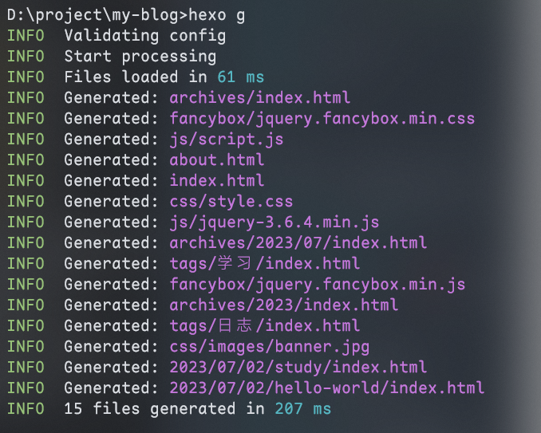

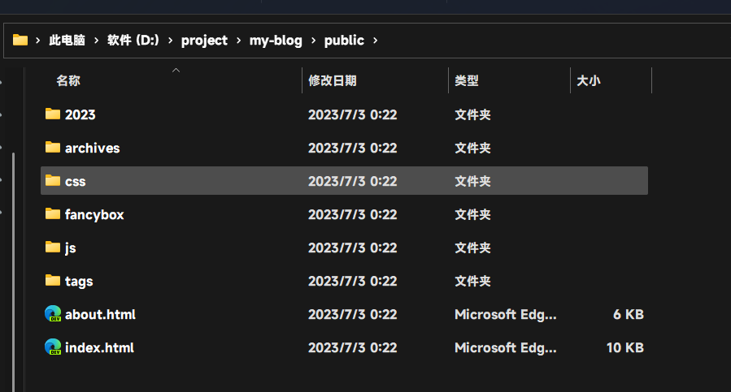

当然，对于类似于 GitHub Pages 的静态托管服务，Hexo 有一套完整的处理方案，方便我们使用。

### 配置 GitHub Pages

官方对于配置 GitHub Pages 已经有了一个非常详细的教程说明：[在 GitHub Pages 上部署 Hexo | Hexo](https://hexo.io/zh-cn/docs/github-pages)

如果你仍有疑问可以评论或者联系我，我会出一个从创建 GitHub 账户到部署 GitHub Pages 的教程。

## 使用主题

官方的默认主题我是看不惯的，我们可以使用其他主题，例如 Next、Sakura、Nexmoe等。这里我以 Nexmoe 为例，安装使用一个主题。

对于 Nexmoe，官方有说明文档：[Hexo Theme Nexmoe | 🔥 一个比较特别的 Hexo 主题](https://docs.nexmoe.com/zh/)

目前 Nexmoe 4.0 版本文档不齐全，还需要参考 3.2 版本的文档：[欢迎 | 🔥 A rather special Hexo theme (nexmoe.com)](https://docs.nexmoe.com/v3.2/)

按照主题文档，我们在博客根目录执行命令：

```bash
npm install hexo-theme-nexmoe @nexmoe/hexo-renderer-inferno
```

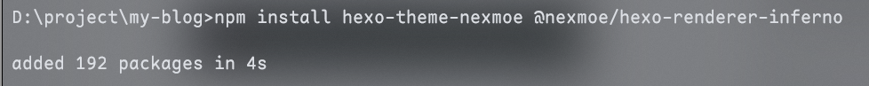

执行后，修改 `_config.yml`，使用 Nexmoe 主题：在博客的根目录中编辑 `_config.yml`。将名为 `theme` 的键的值更改为 `nexmoe`。

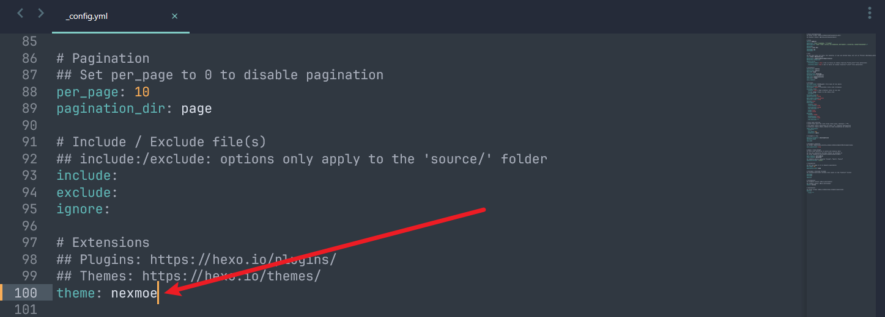

此时，根目录缺少主题配置文件，我们可以参考官方仓库，创建一个 `_config.nexmoe.yml`。官方仓库地址：[nexmoe/nexmoe.com (github.com)](https://github.com/nexmoe/nexmoe.com)

找到官方仓库的 `_config.nexmoe.yml` 文件，复制内容到新建的主题配置文件，并且按照自己的情况修改配置内容。

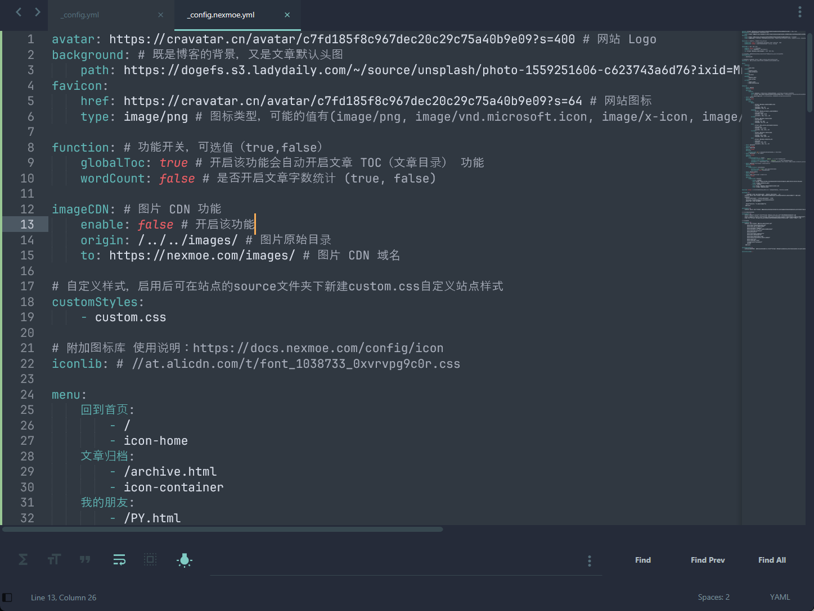

修改完之后我们重启服务，预览效果。

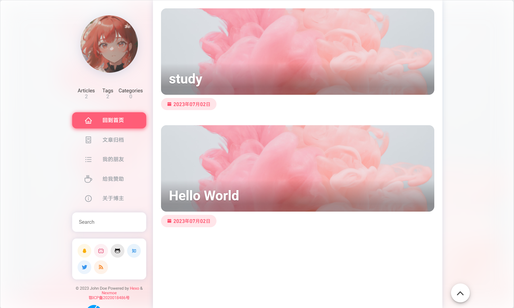

部分为英文是因为配置文件里有语言选项，默认是英语，我没有修改，修改后可为中文。在 `_config.yml` 里找到 `lanugage` 选项，将内容修改为 `zh-CN` 即可。如果是 `zh` 的话会是繁体中文。


尽情享受你的记录博客之旅吧。

## 最后

如果修改的配置等重启服务后不能及时生效，记得清理缓存，指令为：

```bash
hexo clean
```

当然还有其他指令，具体移步：[指令 | Hexo](https://hexo.io/zh-cn/docs/commands)

安装插件方法非常简单，但是也因插件而异，如果需要啥插件，可以到搜索引擎搜索。

如果要记录博客，一定要坚持，博客不仅是记录自己的学习记录，更是自己的知识储备。我们难免会忘记一些知识，如果我们记录在了博客，下次遇到同样的问题可以直接翻找自己的博客，稍微看一下就能记起来了，我们肯定不能记住所有的东西，博客就是我们的第二大脑。

不仅如此，博客不仅会在必要的时候帮助自己还会帮助遇到同样问题的其他人。
