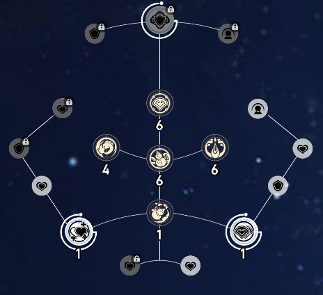

> 我们在 Canvas 中绘制我们的图片图标时经常会遇到需要更改颜色的情况。本文将讲述一种方法。

## 原理

使用临时的 Canvas DOM 绘制图片，并使用 `globalCompositeOperation` 加上 `fillRect` 绘制到目标（已有）的图像上，最后将临时的 Canvas 绘制到最重要实现的 Canvas 上。

## 需求分析

我们需要绘制一个类似于“技能树”的效果，效果图片如下：



我们的这些图标图片都是远程并且颜色都为白色和灰色混合颜色（带有透明度），如下图所示：


我们通过一定条件进行判断我们要填充的颜色 `imageColor`（示例中有三种：黑色、白色、金色），大小 `width` 和 `height` 以及位置 `x` 、`y` 也是事先处理好的，具体要根据我们的业务进行调整。

```tsx
const icon:HTMLImageElement = new Image(); // 创建图片
icon.setAttribute("crossOrigin", "anonymous"); // 跨域图片处理
icon.src = "xxxx";
icon.onload = () => {
  applyImageColor(  // 这个是我们待实现的函数
    icon, // 图片 Dom
    imageColor, //填充颜色
    x + 5, // 位置 x
    y + 5, // 位置 y
    width - 10, // 绘制宽度
    height - 10 // 绘制高度
  );
}
```

接下来我们就要实现 `applyImageColor` 函数，让它成为一个通用的绘制函数。

## 创建临时 `Canvas` 绘制图片

我们要实现图片纯色填充，首先要创建一个临时 `Canvas`，将我们的图片绘制在上面：

```tsx
const applyImageColor = (
    img: HTMLImageElement,
    color: string,
    x: number,
    y: number,
    width: number,
    height: number
  ) => {
    // 创建临时 Canvas
    const tempCanvas: HTMLCanvasElement = document.createElement("canvas");
    // 获取 CTX
    const tempCtx: CanvasRenderingContext2D | null =
      tempCanvas.getContext("2d");
    if (!tempCtx) return;
    // 将临时 Canvas 的宽高设置为图片的宽高
    tempCanvas.width = img.width;
    tempCanvas.height = img.height;

    // 绘制原始图像
    tempCtx.drawImage(img, 0, 0);
    
    // …… 后面进行处理 ①
  };
```

我们就绘制了一个临时的 `Canvas`，大小为我们的图片大小，内容为我们的图片。

## 填充颜色

`Canvas Context2D` 提供了一个属性 `globalCompositeOperation`，  W3School 中是这么解释的：

> **定义和用法**
>
> `globalCompositeOperation` 属性设置或返回如何将一个源（新的）图像绘制到目标（已有）的图像上。
>
> 源图像 = 您打算放置到画布上的绘图。
>
> 目标图像 = 您已经放置在画布上的绘图。

也就是说我们可以绘制一个矩形放到已经绘制的图片上。

```tsx
tempCtx.globalCompositeOperation = "source-in"; // 混合模式为 source-in
tempCtx.fillStyle = color; // 将填充颜色设置为我们传入的颜色参数
tempCtx.fillRect(0, 0, tempCanvas.width, tempCanvas.height); // 填充矩形
```

此时我们绘制的矩形将填充我们之前绘制的图片。

## 将修改后的 `Canvas` 绘制到之前的 `Canvas`

如果我们一共只需要一个 `Canvas`，我们可以直接在函数里面获取 `Canvas` 并进行绘制，如果我们有多个 `Canvas`，并且此函数为通用函数，我们可以通过传参方式传入我们的 `Canvas`。我们这里只需要一个 `Canvas` 来绘制我们的技能树，并且我们使用 `React` 框架，提供了 `useRef` 方便我们获取虚拟 DOM。

```tsx
const canvas = canvasRef.current; // 获取 Canvas
if (canvas) {
  // 获取 CTX
  const ctx = canvas.getContext("2d");
  if (ctx) {
    // 将临时画布绘制到目标画布
    ctx.drawImage(tempCanvas, x, y, width, height);
    // 销毁临时画布
    tempCanvas.remove();
  }
}
```

在临时 `Canvas` 使用完后进行销毁即可。

这样，我们就写了一个通用函数绘制纯色填充图片。

效果正如开头所示。

完整函数：

```tsx
const applyImageColor = (
    img: HTMLImageElement,
    color: string,
    x: number,
    y: number,
    width: number,
    height: number
  ) => {
    const tempCanvas: HTMLCanvasElement = document.createElement("canvas");
    const tempCtx: CanvasRenderingContext2D | null =
      tempCanvas.getContext("2d");
    if (!tempCtx) return;
    tempCanvas.width = img.width;
    tempCanvas.height = img.height;

    // 绘制原始图像
    tempCtx.drawImage(img, 0, 0);

    // 修改图像颜色
    tempCtx.globalCompositeOperation = "source-in";
    tempCtx.fillStyle = color;
    tempCtx.fillRect(0, 0, tempCanvas.width, tempCanvas.height);

    // 将修改后的图像绘制回画布
    // 获取画布，这里使用了 React 的 useRef，在原生中可以使用 querySelector
    const canvas = canvasRef.current;
    if (canvas) {
      const ctx = canvas.getContext("2d");
      if (ctx) {
        ctx.drawImage(tempCanvas, x, y, width, height);
        // 销毁临时画布
        tempCanvas.remove();
      }
    }
  };
```


## 使用

我们写完此函数后就可以直接使用：

首先创建图片，在图片加载完成后，使用此函数，传参依次为：

```tsx
const icon:HTMLImageElement = new Image(); // 创建图片
icon.setAttribute("crossOrigin", "anonymous"); // 跨域图片处理
icon.src = "xxxx"; // 图片地址
// 图片加载完成
icon.onload = () => {
  // 使用函数
  applyImageColor(
    icon, // 图片 Dom
    imageColor, //填充颜色
    x + 5, // 起始位置 x
    y + 5, // 起始位置 y
    width - 10, // 绘制的宽度
    height - 10 // 绘制的高度
  );
}
```

